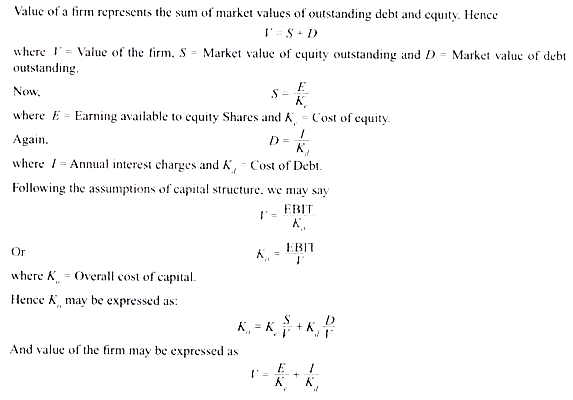

# Capital Structure #

> “Capital structure is essentially concerned with how the firm decides to divide its cash flows into two broad components, a fixed component that is earmarked to meet the obligations toward debt capital and a residual component that belongs to equity shareholders”
> 
> -P. Chandra.

# Concept of Capital Structure

The relative proportion of various sources of funds used in a business is termed as financial structure. Capital structure is a part of the financial structure and refers to the proportion of the various long-term sources of financing. It is concerned with making the array of the sources of the funds in a proper man­ner, which is in relative magnitude and proportion.

The capital structure of a company is made up of debt and equity securities that comprise a firm’s financing of its assets. It is the permanent financing of a firm represented by long-term debt, preferred stock and net worth. So it relates to the arrangement of capital and excludes short-term borrowings. It denotes some degree of permanency as it excludes short-term sources of financing.

Again, each component of capital structure has a different cost to the firm. In case of companies, it is financed from various sources. In proprietary concerns, usually, the capital employed, is wholly contributed by its owners. In this context, capital refers to the total of funds supplied by both—owners and long-term creditors.

The question arises: What should be the appropri­ate proportion between owned and debt capital? It depends on the financial policy of individual firms. In one company debt capital may be nil while in another such capital may even be greater than the owned capital. The proportion between the two, usually expressed in terms of a ratio, denotes the capital structure of a company.

# Definition of Capital Structure

Capital structure is the mix of the long-term sources of funds used by a firm. It is made up of debt and equity securities and refers to permanent financing of a firm. It is composed of long-term debt, prefer­ence share capital and shareholders’ funds.

Various authors have defined capital structure in different ways.

Some of the important definitions are presented below.

According to Gerestenberg,

> ‘capital structure of a company refers to the composition or make up of its capitalization and it includes all long term capital resources viz., loans, reserves, shares and bonds’. Keown et al. defined capital structure as, ‘balancing the array of funds sources in a proper manner, i.e. in relative magnitude or in proportions’.

In the words of P. Chandra, 

> ‘capital structure is essentially concerned with how the firm decides to divide its cash flows into two broad components, a fixed component that is earmarked to meet the obligations toward debt capital and a residual component that belongs to equity shareholders’.

Hence capital structure implies the composition of funds raised from various sources broadly classi­fied as debt and equity. It may be defined as the proportion of debt and equity in the total capital that will remain invested in a business over a long period of time. Capital structure is concerned with the quantitative aspect. A decision about the proportion among these types of securities refers to the capital structure decision of an enterprise.

# Importance of Capital Structure

Decisions relating to financing the assets of a firm are very crucial in every business and the finance manager is often caught in the dilemma of what the optimum proportion of debt and equity should be. As a general rule there should be a proper mix of debt and equity capital in financing the firm’s assets. Capital structure is usually designed to serve the interest of the equity shareholders.

Therefore instead of collecting the entire fund from shareholders a portion of long term fund may be raised as loan in the form of debenture or bond by paying a fixed annual charge. Though these payments are considered as expenses to an entity, such method of financing is adopted to serve the interest of the ordinary share­holders in a better way.

## Value Maximization

Capital structure maximizes the market value of a firm, i.e. in a firm having a properly designed capital structure the aggregate value of the claims and ownership interests of the shareholders are maximized.

## Cost Minimization

Capital structure minimizes the firm’s cost of capital or cost of financing. By determining a proper mix of fund sources, a firm can keep the overall cost of capital to the lowest.

## Increase in Share Price

Capital structure maximizes the company’s market price of share by increas­ing earnings per share of the ordinary shareholders. It also increases dividend receipt of the shareholders.

## Investment Opportunity

Capital structure increases the ability of the company to find new wealth- creating investment opportunities. With proper capital gearing it also increases the confidence of sup­pliers of debt.

## Growth of the Country

Capital structure increases the country’s rate of investment and growth by increasing the firm’s opportunity to engage in future wealth-creating investments.

## Patterns of Capital Structure

There are usually two sources of funds used by a firm: Debt and equity. A new company cannot collect sufficient funds as per their requirements as it has yet to establish its creditworthiness in the market; consequently they have to depend only on equity shares, which is the simple type of capital structure. After establishing its creditworthiness in the market, its capital structure gradually becomes complex.

A complex capital structure pattern may be of following forms:

1. Equity Shares and Debentures (i.e. long term debt including Bonds etc.),

2. Equity Shares and Preference Shares,

3. Equity Shares, Preference Shares and Debentures (i.e. long term debt including Bonds etc.).

However, irrespective of the pattern of the capital structure, a firm must try to maximize the earnings per share for the equity shareholders and also the value of the firm.

Value of Firm is caluclated as

# Optimum Capital Structure of a Firm

## Meaning

An optimum capital structure has such a proportion of debt and equity which will maximise the wealth of the firm.

At this capital structure the market price per share is maximum and cost of capital is minimum.

> E. F. Brigham defines —
> 
> ”the optimum capital structure strikes that balance between risk and return which maximises the price of the stock and simultaneously minimizes the firm’s overall cost of capital.”

Generally speaking, a sound optimum capital structure is one which:

1. Maximises the worth or value of the firm

2. Minimizes the cost of capital

3. Maximises the benefit to the shareholders by giving best earning per share and maximum market price of the shares in the long-run

4. Is fair to employees, creditors and others.

## Features of an Optimum Capital Structure

1. ### Simplicity

    All businessmen are not educated. A complicated capital structure may not be understood by all; on the contrary it may raise suspicions and create confusion. A capital structure must be as simple as possible.

2. ### Profitability

    An optimum capital structure is one which maximises earning per equity share and minimizes cost of financing.

3. ### Solvency

    In a sound capital structure, content of debt will be a reasonable proportion of the total capital employed in the business. As a result, it has minimum risk of becoming insolvent.

4. ### Flexibility

    The capital structure of a firm should be such that it can raise funds as when required.

5. ### Conservatism

    The debt content in the capital structure of a firm should be within its borrowing limits. It should be free from the risk of insolvency.

6. ### Control

    The capital structure should be designed in a such a way that it involves minimum risk of loss of control of the firm.

7. ### Optimal debt-equity mix

    Optimal debt-equity mix in the capital structure of a company would be that point where the weighted average cost of capital is minimum. Optimum debt- equity proportion establishes balance between owned capital and debt capital. The firm should be cautious about the financial risk associated with the maximum utilisation of debt.

8. ### Maximisation of the value of the firm
    An optimum capital structure makes the value of the firm maximum.

[Theories of capital structure](http://www.yourarticlelibrary.com/financial-management/capital-structure/top-4-theories-of-capital-structure-with-calculations/65449)

