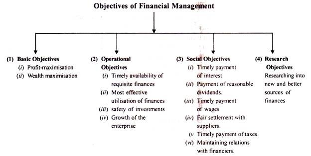
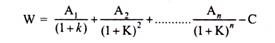

## Financial Management ##

# Definition

One needs money to make money. Finance is the life-blood of business and there must be a continuous flow of funds in and out of a business enterprise. Money makes the wheels of business run smoothly. Sound plans, efficient production system and excellent marketing network are all hampered in the absence of an adequate and timely supply of funds.

Sound financial management is as important in business as production and marketing. A business firm requires finance to commence its operations, to continue operations and for expansion or growth. Finance is, therefore, an important operative function of business.

A large business firm has to raise funds from several sources and has to utilise those funds in alternative investment opportunities. In order to ensure the most judicious utilisation of funds and to provide a reasonable rate of return on the investment, sound financial policies and programmes are required. Unwise financing can drive a business into bankruptcy just as easily as a poor product, inept marketing or high production costs.

On the other hand, adequate and economical financing can provide the firm a differential advantage in the market place. The success of a business enterprise is largely determined by the way its capital funds are raised, utilised and disbursed. In the modern money-using economy, the importance of finance has increased further due to increasing scale of operations and capital intensive techniques of production and distribution.

In fact, finance is the bright thread running through all business activity. It influences and limits the activities of marketing, production, purchasing and personnel management. The success of a business is measured largely in financial terms. The efficient organisation and administration of the finance function is thus vital to the successful functioning of every business enterprise.

# Meaning of Financial Management

Financial management may be defined as planning, organising, directing and controlling the financial activities of an organisation. According to Guthman and Dougal, financial management means, “the activity concerned with the planning, raising, controlling and administering of funds used in the business.” It is concerned with the procurement and utilisation of funds in the proper manner.

Financial activities deal with not only the procurement and utilisation of funds but also with the assessing of needs for funds, raising required finance, capital budgeting, distribution of surplus, financial controls, etc.

Ezra Solomon has described the nature of financial management as follows: “Financial management is properly viewed as an integral part of overall management rather than as a staff specially concerned with funds raising operations.

In this broader view, the central issue of financial policy is the wise use of funds and the central process involved is a rational matching of the advantage of potential uses against the cost of alternative potential sources so as to achieve the broad financial goals which an enterprise sets for itself.

In addition to raising funds, financial management is directly concerned with production, marketing and other functions within an enterprise whenever decisions are made about the acquisition or distribution of funds.”

# Objectives of Financial Management

Financial management is one of the functional areas of business. Therefore, its objectives must be consistent with the overall objectives of business. The overall objective of financial management is to provide maximum return to the owners on their investment in the long- term.

This is known as wealth maximisation. Maximisation of owners’ wealth is possible when the capital invested initially increases over a period of time. Wealth maximisation means maximising the market value of investment in shares of the company.

> Wealth of shareholders = Number of shares held × Market price per share.

In order to maximise wealth, financial management must achieve the following specific objectives:

1. To ensure availability of sufficient funds at reasonable cost (liquidity).

2. To ensure effective utilisation of funds (financial control).

3. To ensure safety of funds by creating reserves, re-investing profits, etc. (minimisation of risk).

4. To ensure adequate return on investment (profitability).

5. To generate and build-up surplus for expansion and growth (growth).

6. To minimise cost of capital by developing a sound and economical combination of corporate securities (economy).

7. To coordinate the activities of the finance department with the activities of other departments of the firm (cooperation).

## Profit Maximisation

Very often maximisation of profits is considered to be the main objective of financial management. Profitability is an operational concept that signifies economic efficiency. Some writers on finance believe that it leads to efficient allocation of resources and optimum use of capital.

It is said that profit maximisation is a simple and straightforward objective. It also ensures the survival and growth of a business firm. But modern authors on financial management have criticised the goal of profit maximisation.

Objections by **Ezra Solomon** against the Profit Maximisation Objectives.

1. The concept is ambiguous or vague. It is amenable to different interpretations, e.g., long run profits, short run profits, volume of profits, rate of profit, etc.

2. It ignores the timing of returns. It is based on the assumption of bigger the better and does not take into account the time value of money. The value of benefits received today and those received a year later are not the same.

3. It ignores the quality of the expected benefits or the risk involved in prospective earnings stream. The streams of benefits may have varying degrees of uncertainty. Two projects may have same total expected earnings but if the earnings of one fluctuate less widely than those of the other it will be less risky and more preferable. More uncertain or fluctuating the expected earnings, lower is their quality.

4. It does not consider the effect of dividend policy on the market price of the share. The goal of profit maximisation implies maximising earnings per share which is not necessarily the same as maximising market-price share. According to Solomon, “to the extent payment of dividends can affect the market price of “the stock (or share), the maximisation of earnings per share will not be a satisfactory objective by itself.”

5. Profit maximisation objective does not take into consideration the social responsibilities of business. It ignores the interests of workers, consumers, government and the public in general. The exclusive attention on profit maximisation may misguide managers to the point where they may endanger the survival of the firm by ignoring research, executive development and other intangible investments.

## Wealth Maximisation

Prof. Ezra Solomon has advocated wealth maximisation as the goal of financial decision-making. Wealth maximisation or net present worth maximisation is defined as follows: “The gross present worth of a course of action is equal to the capitalised value of the flow of future expected benefits, discounted (or as capitalised) at a rate which reflects their certainty or uncertainty.

Wealth or net present worth is the difference between gross present worth and the amount of capital investment required to achieve the benefits being discussed. Any financial action which creates wealth or which has a net present worth above zero is a desirable one and should be undertaken.

Any financial action which does not meet this test should be rejected. If two or more desirable courses of action are mutually exclusive (i.e., if only one can be undertaken), then the decision should be to do that which creates most wealth or shows the greatest amount of net present worth. In short, the operating objective for financial management is to maximise wealth or net present worth.”

Wealth maximisation is more operationally viable and valid criterion because of the following reasons:

1. It is a precise and unambiguous concept. The wealth maximisation means maximising the market value of shares.

2. It takes into account both the quantity and quality of the expected steam of future benefits. Adjustments are made for risk (uncertainty of expected returns) and timing (time value of money) by discounting the cash flows,

3. As a decision criterion, wealth maximisation involves a comparison of value of cost. It is a long-term strategy emphasising the use of resources to yield economic values higher than joint values of inputs.

4. Wealth maximisation is not in conflict with the other motives like maximisation of sales or market share. It rather helps in the achievement of these other objectives. In fact, achievement of wealth maximisation also maximises the achievement of the other objectives. Therefore, maximisation of wealth is the operating objective by which financial decisions should be guided.

The above description reveals that wealth maximisation is more useful if objective than profit maximisation. It views profits from the long-term perspective. The true index of the value of a firm is the market price of its shares as it reflects the influence of all such factors as earnings per share, timing of earnings, risk involved, etc.

Thus, the wealth maximisation objective implies that the objective of financial management should be to maximise the market price of the company’s shares in the long-term. It is a true indicator of the company’s progress and the shareholder’s wealth.

However, “profit maximisation can be part of a wealth maximisation strategy. Quite often the two objectives can be pursued simultaneously but the maximisation of profits should never be permitted to overshadow the broader objectives of wealth maximisation.

# Nature of Financial Management

Nature of financial management could be spotlighted with reference to the following aspects of this discipline:

1. Financial management is a specialized branch of general management, in the present-day-times. Long back, in traditional times, the finance function was coupled, either with production or with marketing; without being assigned a separate status.

2. Financial management is growing as a profession. Young educated persons, aspiring for a career in management, undergo specialized courses in Financial Management, offered by universities, management institutes etc.; and take up the profession of financial management.

3. Despite a separate status financial management, is intermingled with other aspects of management. To some extent, financial management is the responsibility of every functional manager. For example, the production manager proposing the installation of a new plant to be operated with modern technology; is also involved in a financial decision.

    Likewise, the Advertising Manager thinking, in terms of launching an aggressive advertising programme, is too, considering a financial decision; and so on for other functional managers. This intermingling nature of financial management calls for efforts in producing a co­ordinated financial system for the whole enterprise.

4. Financial management is multi-disciplinary in approach. It depends on other disciplines, like Economics, Accounting etc., for a better procurement and utilisation of finances.

    For example, macro-economic guides financial management as to banking and financial institutions, capital market, monetary and fiscal policies to enable the finance manager decide about the best sources of finances, under the economic conditions, the economy is passing through.

    Micro-economics points out to the finance manager techniques for profit maximisation, with the limited finances at the disposal of the enterprise. Accounting, again, provides data to the finance manager for better and improved financial decision making in future.

5. The finance manager is often called the Controller; and the financial management function is given name of controllership function; in as much as the basic guideline for the formulation and implementation of plans-throughout the enterprise-come from this quarter.

    The finance manager, very often, is a highly responsible member of the Top Management Team. He performs a trinity of roles-that of a line officer over the Finance Department; a functional expert commanding subordinates throughout the enterprise in matters requiring financial discipline and a staff adviser, suggesting the best financial plans, policies and procedures to the Top Management.

    In any case, however, the scope of authority of the finance manager is defined by the Top Management; in view of the role desired of him- depending on his financial expertise and the system of organizational functioning.

6. Despite a hue and cry about decentralisation of authority; finance is a matter to be found still centralised, even in enterprises which are so called highly decentralised. The reason for authority being centralised, in financial matters is simple; as every Tom, Dick and Harry manager cannot be allowed to play with finances, the way he/she likes. Finance is both-a crucial and limited asset-of any enterprise.

7. Financial management is not simply a basic business function along with production and marketing; it is more significantly, the backbone of commerce and industry. It turns the sand of dreams into the gold of reality.

No production, purchases or marketing are possible without being duly supported by requisite finances. Hence, Financial Management commands a higher status vis-a-vis all other functional areas of general management.

# Objectives of Financial Management

Objectives of financial management may be multiple; as this branch of general management encompasses the entire organizational functioning.

## Basic Objectives

### Profit-Maximisation

Since time immemorial, the primary objective of financial management has been held to be profit-maximisation. That is to say, that financial management ought to take financial decisions and implement them in a way so as to lead the enterprise along lines of profit maximasation. The support for these objectives could be derived from the philosophy, that ‘profit is a test of economic efficiency’.

Though, there could be little controversy over profit maximisation, as the basic objective of financial management – yet, in the modern times, several authorities on financial management criticise this objectives, on the following grounds:

1. Profit is a vague concept, in that; it is not clear whether profit means – short-run or long-run profits. Or

    – Profit before tax or profits after tax or

    – Rate of profits or the amount of profits.

2. The profit maximisation objective ignores, what financial experts call the time value of money’. To illustrate, this concept, let us assume that two financial courses of action provide equal benefits (i.e. profits) over a certain period of time. However, one alternative gives more profits in earlier years; while the other one gives more profits in later years.

    Based on profit maximization criterion, both alternatives are equally well. However, the first alternative i.e. the one which gives more profits in earlier years is better; as some part of the profits received earlier could be reinvested also.

    Modern financial experts call this philosophy, ‘the earlier the better principle’. The second alternative which gives more profits only in later years is inferior; as the time-value of profits is more in the case of the first alternative.

3. The profit maximization objective ignores the quality of benefits (i.e. profits). The factor implicit here, is the risk element associated with profits. Quality of benefits (profits) is the most when risk associated with their occurrence is the least. According to modern financial experts, less profit with less risk are superior to more profits with more risk.

4. Profit-maximisation objective is lop-sided. This objective considers or rather over-emphasizes only on the interests of owners. Interests of other parties like, workers, consumers, the Government and the society as a whole are ignored, under this concept of profit-maximisation.

### Wealth-Maximisation

Discarding the profit-maximisation objective; the real basic objective of financial management, now-a-days, is considered to be wealth maximisation. Wealth maximisation is also known as value-maximisation or the net present worth maximisation.

Since wealth of owners is reflected in the market-value of shares; wealth maximisation means the maximisation of the market price of shares. Accordingly, wealth maximisation is measured, by the market value of shares.

According to wealth maximisation objective, financial management must select those decisions, which create most wealth for the owners. If two or more financial courses of action are mutually exclusive (i.e. only one can be undertaken at a time); then that decision-which creates most wealth, must be selected.

The wealth arising from a financial course of action could be stated as follows:

> Wealth = Gross present worth of a financial course of action minus amount of capital invested which is required to achieve the benefits i.e. cash flows.

**Explanation:**

The gross present worth of a financial course of action is equal to the capitalized value of the flow of expected future benefits (i.e. cash flows); which are discounted at a rate – reflecting both- time value of money and their quality (i.e. the risk associated with benefits).

> Mathematically, the wealth arising from a financial course of action could be calculated as follows:
> 
> 
>
> Where,
>
> W = Wealth, arising from a financial course of action.
>
> A1, A2, An = Stream of cash flows expected to come from the financial course of action,
> 
> K = Appropriate discount rate, reflecting time value of money and quality of benefits, associated with the financial course of action.
> 
> and C = initial capital outlay to pursue that financial course of action.

The wealth maximisation objective is held to be superior to the profit maximisation objective, because of the following reasons.

1. It is based on the concept of cash flows; which is more definite than the concept of profits. Moreover, management is more interested in immediate cash flows than the profits a large part of which might be hidden in credit sales- still to be realized.

2. Through discounting the cash flows arising from a financial course of action over a period of time at an appropriate discount rate; the wealth maximisation approach considers both- the time value of money and the quality of benefits.

3. Wealth maximisation objective is consistent with the long term profitability of the company.

## Operational Objectives

### Timely Availability of Requisite Finances

A very important operational objective of financial management is to ensure that requisite funds are made available to all the departments, sections or units of the enterprise at the needed time; so that the operational life of the enterprise goes smoothly.

### Most Effective Utilization of Finances

Throughout the enterprise, the finances must be utilized most effectively. This is yet, another important operational objective of the financial, management.

To ensure the attainment of this objective, the financial management must:

- Formulate plans for the most effective utilisation of funds, among channels of investment, which create most wealth for the company.

- Exercise and enforce ‘financial discipline’ to prevent wasteful expenditure, by any department, or branch or section of the enterprise.

### Safety of Investment

The financial management must primarily look to the safety of investment i.e. the channels of investment might bring in less returns; but investment must be safe. Loss of investment, in any one line, might lead to capital depletion; and ultimately tell upon the financial health of the enterprise.

### Growth of the Enterprise

The financial management must plan for the long-term stability and growth of the enterprise. The limited finances of the enterprise must be so utilized that not only short run benefits are available; but the enterprise grows slow and steady, in the long run also.

## Social Objectives

### Timely Payment of Interest

The financial management must see to it that interest on bonds, debentures or other loans of the company is paid in time. This will not only keep the creditors satisfied with the company adding to its goodwill; but also prevent any untoward consequences of the non-payment of interest, in time.

### Payment of Reasonable Dividends

An important social objective of financial management is that shareholders i.e. the equity members of the company must get at least some regular dividends.

This objective is important for two reasons: –

- It helps the company maintain its competitive image, in the market.

- The members on whose funds the company is running profitable operations must be duly compensated, as a matter of natural justice.

### Timely Payment of Wages

The financial management must make a provision for a timely payment of wages to workers. This is necessary to keep the labor force satisfied and motivated. Further, if wages are paid on time; the legal consequences of non-payment of wages, under the ‘ Payment of Wages Act’, need not frighten management.

### Fair-Settlement with Suppliers

The financial management must make it a point to settle accounts with suppliers and fellow- businessmen in time, in a fair way; otherwise the commercial reputation of the enterprise will get a setback.

### Timely Payment of Taxes

An important objective of financial management would be to make timely payment of taxes to the Government – so as to avoid legal consequences; and also fulfill its social obligations towards the State.

### Maintaining Relations with Financiers

The financial management must develop and maintain friendly relations with financiers i.e. banks, financial institutions and various segments of the money market and capital market. When good relations are maintained with financiers; they might come to the rescue of the enterprise, in situations of financial crisis.

## Research Objectives

The successful attainment of various objectives by the financial management requires it to follow a research approach. It must research into new and better sources of finances; and also into new and better channels for the investment of finances.

This research objective of financial management requires it to:

- Collect financial data about the progress of its competitive counterparts.

- Make a study of money market and capital market operations, through a study of latest financial magazines and other literature on financial management.