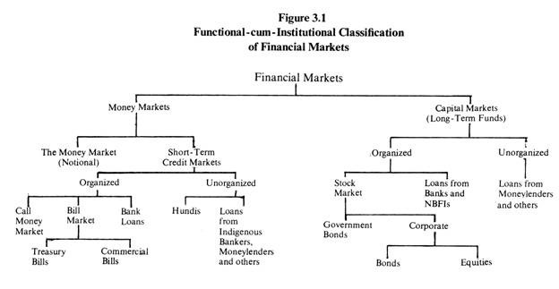

## Indian Financial System ##

Financial system operates through financial markets and institutions.

The Indian Financial system (financial markets) is broadly divided under two heads:

1. Indian Money Market

2. Indian Capital Market

The Indian money market is the market in which short-term funds are borrowed and lent. The money market does not deal in cash, or money but in bills of exchange, grade bills and treasury bills and other instruments. The capital market in India on the other hand is the market for the medium term and long term funds.

The structure of financial markets can be studied from different angles, namely, functional, institutional, or sectoral. Accordingly, financial markets, institutions, and instruments can be classified in any one or more of these ways. The functional classification is based on the term of credit, whether the credit supplied is short-term or long-term. Accordingly, markets are called money markets or capital markets.

The institutional classification tells us whether the financial institutions are organized on commercial or cooperative principles and whether they belong to the organized or unorganized sector. The sectoral classification identifies credit arrangements for various sectors of the economy: agriculture, manufacturing industry, trade and others.

Various classifications are not intended to be water-tight or mutually exclusive. Their aim is to give a broad idea of the scope of financial markets, their several dimensions and functions. Combining the first two bases of study, we give a single functional- cum-institutional classification in Figure.

Functionally, financial markets are broadly sub-divided under two heads money markets and capital markets. The former are markets in short-term funds; the latter in long-term funds. We have interpreted the term money market more broadly to include within its folds also the notional money market of monetary theory.

This market is co-terminus with the entire economy. The asset it deals in is money; the demanders are the holders of money (the public) and the suppliers are the government, the RBI and banks. Money itself is acquired in the normal process of selling goods, services, and assets in all markets, as money is the common medium of exchange (in all monetised transactions).

There is no special or separate market for money like the ones we have for bills, bonds, or equity shares. In academic discussions of monetary theory and policy whenever the term money market is used, we mean the market for money as explained above. But in business parlance the term money market is almost always used in the sense of short-term credit market.

Structurally, the short-term credit market is divisible under two sectors: organized and unorganized. The organized market com­prises the RBI and banks. It is called organized because its parts are systematically coordinated by the RBI.

Non-bank financial institu­tions such as the LIC, the GIC and subsidiaries, the UTI also operate in this market, but only indirectly through banks and not directly. Quasi-government bodies and large companies may also make their short-term surplus funds available to the market through banks.

Besides commercial banks that dominate the organized money market, there are co-operative banks. They are a part of co-operative credit institutes that have a three-tier structure. At the top there are state co-operative banks (co-operation being a state subject). At the district level there are central co-operative banks. At local level there are primary credit societies and urban co-operative banks.

The whole co-operative credit system is linked with the RBI and is dependent on it for funds. The RBI deals directly with only state co-operative banks. For reasons of size, methods of operation and dealings with the RBI and commercial banks, only state and central co-operative banks need be counted into the organized money market; the rest (co-operative credit societies at local level) are only loosely linked with it.

The unorganized market is largely made up of indigenous bankers and moneylenders, professional and non-professional. It is unorganized because the activities of its parts are not systematically coordinated by the RBI or any other authority.

Private moneylenders operate throughout the length and breadth of the country, but without any link among themselves. Indigenous bankers are better organized on local basis, as in Bombay and Ahmedabad. But this kind of organization is also only a loose association.

For the success of monetary and credit policy, the character of the money market is important. The unorganized sector of the market is practically insulated from monetary and credit controls. It is neither subject to reserve requirements, nor capital or investment require­ments. Its dependence on the RBI or banks for funds is very limited.

Therefore, it is not affected directly by (say) the policy of monetary restraint of the economy. The RBI has no control over the quality and composition of credit in this market either. This works as an important limitation to the working of monetary policy in India. But since 1947 the situation is rapidly changing with the fast expansion of banking in the country and the relative shrinkage of the unorganized sector of the money market. There are three main components of the organized sector of the money markets.

1. Inter-bank call money market

2. Bill market

3. Bank loan market

The unorganized sector also has its comparable markets. But its call money market is very small and restricted only to the Gujarati shroffs (one component of indigenous bankers). The other two markets are quite important. The indigenous bills are called hundis, and the hundi market is quite active. The indigenous bankers and moneylenders are still the major source of short-term loans for the small borrower.

The main function of the money market is to provide short-term funds to deficit spenders, whether the government or others. It does this mainly by mobilising short-term surpluses of both financial and non-financial units, including state governments, local governments, and quasi-government bodies.

Banks do it by ‘selling’ deposits of various kinds, participation Certificates and bills discounted. Then, there are treasury bills sold ‘on tap’ by the RBI. The RBI itself serves as the lender of last resort to the market. Funds have also to be moved between regions and from one place to another according to demand. An efficient and well- developed system does it fast and at low cost.

Also, it does not allow regional or sectoral scarcities of funds to emerge. The surpluses in some centres or sectors get immediately transferred to others in short supply. Thereby an even supply of funds and liquidity is maintained throughout the economy. For this, banks and other constituents of money market must have an inter-connected network of branches and offices, rapid communication and remittance-of-funds system, and well-trained staff.

The real economy may also nave a seasonal pattern, giving rise to seasonal ups and downs in the demand for funds. In the Indian economy this kind of seasonality mainly arises from the seasonal character of agriculture and some agro based industries (such as sugar) and their large weight in the overall economy. Thus, traditionally, the Indian money market has been facing two seasons’ busy season from October to April and slack season from May to September.

During the busy season the main (Kharif) crops are harvested and marketed and sugarcane is crushed. So, the demand for bank credit to traders and sugar manufacturers goes up. During the slack season this demand for funds goes down. The RBI has been following a pro seasonal monetary policy so that any special stringency of funds does not arise during the busy season which may hurt legitimate economic activity.

For some time past, with increased double cropping of cultivated land, hefty increases in the output of wheat (a major rabi crop) and autumn rice, growth of perennial industries, and a higher proportion of bank credit going to manufacturing industries, the previous seasonal ups and downs in the demand for funds have largely lost their importance. This trend is likely to gain in strength over time.

The capital market deals in medium-term and long-term funds. Like money market, the capital market also is divisible into two sectors organized and unorganized. The organized sector comprises the stock market, the RBI, banks, development banks (such as the Industrial Develop­ment Bank of India), LIC, GIC and subsidiaries, and the UTI.

The unorganized sector is mainly made up of indigenous bankers and money-lenders chit funds, nidhis and similar other financial institu­tions; investment companies, finance companies and hire purchase companies; and company deposits. The role of the unorganized sector in the capital market is of very limited importance.