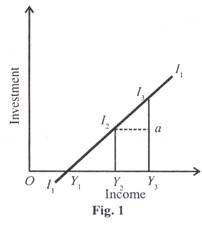

## Investment Function ##

# Meaning of Capital and Investment

In ordinary parlance, investment means to buy shares, stocks, bonds and securities which already exist in stock market. But this is not real investment because it is simply a transfer of existing assets. Hence this is called financial investment which does not affect aggregate spending. In Keynesian terminology, investment refers to real investment which adds to capital equipment.

It leads to increase in the levels of income and production by increasing the production and purchase of capital goods. Investment thus includes new plant and equipment, construction of public works like dams, roads, buildings, etc., net foreign investment, inventories and stocks and shares of new companies. In the words of Joan Robinson, “By investment is meant an addition to capital, such as occurs when a new house is built or a new factory is built. Investment means making an addition to the stock of goods in existence.”

Capital, on the other hand, refers to real assets like factories, plants, equipment, and inventories of finished and semi-finished goods. It is any previously produced input that can be used in the production process to produce other goods. The amount of capital available in an economy is the stock of capital. Thus capital is a stock concept.

To be more precise, investment is the production or acquisition of real capital assets during any period of time. To illustrate, suppose the capital assets of a firm on 31 March 2004 are Rs 100 crores and it invests at the rate of Rs 10 crores during the year 2004-05. At the end of the next year (31 March 2005), its total capital will be Rs 110 crores. Symbolically, let I be investment and К be capital in year t, then 

> It = Kt – Kt - 1.

Capital and investment are related to each other through net investment. Gross investment is the total amount spent on new capital assets in a year. But some capital stock wears out every year and is used up for depreciation and obsolescence. Net investment is gross investment minus depreciation and obsolescence charges for replacement investment. This is the net addition to the existing capital stock of the economy.

If gross investment equals depreciation, net investment is zero and there is no addition to the economy’s capital stock. If gross investment is less than depreciation, there is disinvestment in the economy and the capital stock decreases. Thus for an increase in the real capital stock of the economy, gross investment must exceed depreciation, i.e., there should be net investment.

# Types of Investment

## Induced Investment

Real investment may be induced. Induced investment is profit or income motivated. Factors like prices, wages and interest changes which affect profits influence induced investment. Similarly demand also influences it. When income increases, consumption de­mand also increases and to meet this, investment increases. In the ultimate analysis, induced investment is a function of in­come i.e., `I = f(Y)`. It is income elastic. It increases or de­creases with the rise or fall in income.

I1 I1 is the investment curve which shows induced invest­ment at various levels of income. Induced investment is zero at OY1 income. When income rises to OY3 induced investment is I3Yy A fall in income to OY2 also reduces induced investment to I2Y2.

Induced investment may be further divided into 

1. Average propensity to invest
   
   The average propensity to invest is the ratio of investment to income, I/Y. If the income is Rs. 40 crores and investment is Rs. 4 crores, I/Y = 4/40 = 0.1. In terms of the above figure, the average propensity to invest at OY3 income level is I3Y3/ OY3

2. Marginal propensity to invest
   
   The marginal propensity to invest is the ratio of change in investment to the change in income, i.e., ∆I/∆Y. If the change in investment, ∆I=Rs 2 crores and the change in income, ∆Y = Rs 10 crores, then ∆I/∆Y = 2/10=0.2 In Figure 1, ∆I/∆Y =I3a/Y2Y3

## Autonomous Investment

Autonomous investment is independent of the level of income and is thus income inelastic. It is influenced by exogenous factors like innovations, inventions, growth of population and labour force, researches, social and legal institutions, weather changes, war, revolution, etc. But it is not influenced by changes in demand. Rather, it influ­ences the demand. Investment in economic and social overheads whether made by the government or the private enterprise is au­tonomous.

Such investment includes expenditure on building, dams, roads, canals, schools, hospitals, etc. Since investment on these projects is generally associated with public policy, autonomous in­vestment is regarded as public investment. In the long-run, private investment of all types may be autonomous because it is influenced by exogenous factors. Diagrammatically, autonomous investment is shown as a curve parallel to the horizontal axis as I1I’ curve in Figure 2. It indicates that at all levels of income, the amount of investment OI1 remains constant.

The upward shift of the curve to I2I” indicates an increased steady flow of investment at a constant rate OI2 at various levels of income. However, for purposes of income determination, the autonomous investment curve is superimposed on the С curve in a 45° line diagram.

3. Determinants of the Level of Investment:

The decision to invest in a new capital asset depends on whether the expected rate of return on the new investment is equal to or greater or less than the rate of interest to be paid on the funds needed to purchase this asset. It is only when the expected rate of return is higher than the interest rate that investment will be made in acquiring new capital assets.

In reality, there are three factors that are taken into consideration while making any investment decision. They are the cost of the capital asset, the expected rate of return from it during its lifetime, and the market rate of interest. Keynes sums up these factors in his concept of the marginal efficiency of capital (MEC).

# Marginal Efficiency of Capital

The marginal efficiency of capital is the highest rate of return expected from an additional unit of a capital asset over its cost. In the words of Kurihara, “It is the ratio between the prospective yield to additional capital goods and their supply price.” The prospective yield is the aggregate net return from an asset during its life time, while the supply price is the cost of producing this asset.

If the supply price of a capital asset is Rs. 20,000 and its annual yield is Rs. 2,000, the marginal efficiency of this asset is 2000/20000 × 100/1 = 10 per cent. Thus the marginal efficiency of capital is the percentage of profit expected from a given investment on a capital asset.

Keynes relates the prospective yield of a capital asset to its supply price and defines the MEC as “equal to the rate of discount which would make the present value of the series of annuities given by the returns expected from the capital assets during its life just equal to its supply price.”

Symbolically, this can be expressed as:

> SP = R1 / ( 1 + i ) + R2 ( 1 + i)1 + Rn / ( 1 + i )n

Where Sp is the supply price or the cost of the capital asset, R1 R2… and Rn are the prospective yields or the series of expected annual returns from the capital asset in the years, 1, 2… and n, i is the rate of discount which makes the capital asset exactly equal to the present value of the expected yield from it.

This i is the MEC or the rate of discount which equates the two sides of the equation. If the supply price of a new capital asset is Rs 1,000 and its life is two years, it is expected to yield Rs 550 in the first year and Rs 605 in the second year. Its MEC is 10 per cent which equates the supply price to the expected yields of this capital asset.

Thus

> (Sp) ₹ 1000 = 550/(1.10) + (605)/(1.10)2 = ₹ 500 + 500

In equation (1), the term R1/(1+i) is the present value (PV) of the capital asset. The present value is “the value of payments to be received in the future.” It depends on the rate of interest at which it is discounted.

Suppose we expect to receive Rs 100 from a machine in a year’s time and the rate of interest is 5 per cent. The present value of this machine is

> R1 / ( 1 + i ) = 100 / ( 1.05 ) = ₹ 95.24

If we expect Rs 100 from the machine after two years then its present value is100/ (1.05)2 = Rs 90.70. The present value of a capital asset is inversely related to the rate of interest. The lower the rate of inter­est, the higher is the present value, and vice versa. For instance, if the rate of interest is 5 per cent, PV of an asset of Rs 100 for one year will be Rs 95.24; at 7 per cent interest rate, it will be Rs 93.45; and at 10 per cent interest rate, it will be Rs 90.91.

The relation between the present value and the rate of interest is shown in Figure 3, where the rate of interest is taken on the horizontal axis while the present value of the project on the vertical axis. The curve PR shows the inverse relation between the present value and the rate of interest. If the current rate of interest is ii the present value of the project is P1 On the other hand, a higher rate of interest (i2) will lead to a lower present value (P2) when the present value curve (PR) cuts the horizontal axis at point (Z), the net present value becomes zero.

As a matter of fact, the MEC is the expected rate of return over cost of a new capital asset. In order to find out whether it is worthwhile to purchase a capital asset it is essential to compare the present value of the capital asset with its cost or supply price. If the present value of a capital asset exceeds its cost of buying, it pays to buy it. On the contrary, if its present value is less than its cost, it is not worthwhile investing in this capital asset.

The same results can be had by comparing the MEC with the market rate of interest. If the MEL of a capital asset is higher than the market rate of interest at which it is borrowed, it pays to purchase the capital asset, and vice versa. If the market interest rate equals the MEC of the capital asset, the firm is said to possess the optimum capital stock.

If the MEC is higher than the rate of interest, there will be a tendency to borrow funds in order to invest in new capital assets. If the MEC is lower than the rate of interest, no firm will borrow to invest in capital assets. Thus the equilibrium condition for a firm to hold the optimum capital stock is where the MEC equals the interest rate.

Any disequilibrium between the MEC and the rate of interest can be removed by changing the capital stock, and hence the MEC or by changing the rate of interest or both. Since the stock of capital changes slowly, therefore, changes in the rate of interest are more important for bringing equilibrium. The above arguments which have been applied to a firm are equally applicable to the economy.

Figure 4 shows the MEC curve of an economy. It has a negative slope (from left to right downward) which indicates that the higher the MEC, the smaller the capital stock. Or, as the capital stock increases, the MEC falls. This is because of the operation of the law of diminishing returns in production.

As a result, the marginal physical productivity of capital and the marginal revenue fall. In the figure, when the capital stock is OK1, the MEC is Or1. As the capital increases from OK1to ОK2 the MEC falls from Or1 to Or2 .The net addition to the capital stock K1K2 represents the net investment in the economy.

Further, to reach the optimum (desired) capital stock in the economy, the MEC must equal the rate of interest. If, as shown in the figure, the existing capital stock is OK1 the MEC is Or2 and the rate of interest is at Or1 Everyone in the economy will borrow funds and invest in capital assets.

This is because MEC (Or1) is higher than the rate of interest (at Or2). This will continue till the MEC (Or1) comes down to the level of the interest rate (at Or2). When the MEC equals the rate of interest, the economy reaches the level of optimum capital stock. The fall in the MEC is due to the increase in the actual capital stock from OK2 to the optimum (desired) capital stock OK2.

The increase in the firm’s capital stock by K1K2 is the net investment of the firm. But it is the rate of interest which determines the size of the optimum capital stock in the economy. And it is the MEC which relates the amount of desired capital stock to the rate of interest. Thus the negative slope of the MEC curve indicates that as the rate of interest falls the optimum stock of capital increases.

# The Marginal Efficiency of Investment (MEI)

The marginal efficiency of investment is the rate of return expected from a given investment on a capital asset after covering all its costs, except the rate of interest. Like the MEC, it is the rate which equates the supply price of a capital asset to its prospective yield. The investment on an asset will be made depending upon the interest rate involved in getting funds from the market. If the rate of interest is high, investment is at a low level.

A low rate of interest leads to an increase in in­vestment. Thus the MEI relates the investment to the rate of interest. The MEI schedule shows the amount of investment demanded at various rates of interest. That is why, it is also called the investment demand schedule or curve which has a negative slope, as shown in Fig. 5(A). At Or1 rate of interest, investment is OF. As the rate of interest falls to Or2, investment increases to ОI”.

To what extent the fall in the interest rate will increase investment depends upon the elasticity of the investment demand curve or the MEI curve. The less elastic is the MEI curve, the lower is the increase in investment as a result of fall in the rate of interest, and vice versa.

In Figure 5 the vertical axis measures the interest rate and the MEI and the horizontal axis meas­ures the amount of investment. The MEI and MEI’ are the investment demand curves. The MEI curve in Panel (A) is less elastic to investment which increases by I’I’’. This is less than the increase in investment I1I”2 shown in Panel (B) where the MEI’ curve is elastic. Thus given the shape and position of the MEI curve, a fall in the interest rate will increase the volume of investment.

On the other hand, given the rate of interest, the higher the MEI, the larger shall be the volume of investment. The higher marginal efficiency of investment implies that the MEI curve shifts to the right. When the existing capital assets wear out, they are replaced by new ones and level of investment increases.

But the amount of induced investment depends on the existing level of total purchasing. So more induced investment occurs when the total purchasing is higher. The higher total purchasing tends to shift the MEI to the right indicating that more induce­ment to investment takes place at a given level of interest rate.

This is explained in Figure 6, where MEI1 and МЕI2 curves indicate two different levels of total purchasing in the economy. Let us suppose that the MEI, curve indicates that at Rs 200 crores of total purchasing, OI1 (Rs 20 crores) investment occurs at Or1 interest rate. If total purchasing rises to Rs 500 crores, the MEI1 curve shifts to the right as МЕI2 and the level of induced investment increases to OI2 (Rs 50 crores) at the same interest rate Or1.

# Distinction between MEC and MEI

Keynes did not distinguish between the marginal efficiency of capital (MEC) and the marginal efficiency of investment (MEI).

But modern economists have made clear distinctions between the two concepts as follows:

1. The MEC is based on a given supply price for capital, and the MEI on induced changes in this price.

2. The MEC shows the rate of return on all successive units of capital without regard to the existing stock of capital. On the other hand, the MEI shows the rate of return on only units of capital over and above the existing stock of capital.

3. In the MEC, the capital stock is taken on the horizontal axis of a diagram, while in the MEI the amount of investment is taken horizontally on the X-axis.

4. The MEC is a ‘stock’ concept, and the MEI is a ‘flow’ concept.

5. The MEC determines the optimum capital stock in an economy at each level of interest rate. The MEI determines the net investment of the economy at each interest rate, given the capital stock.