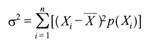
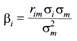
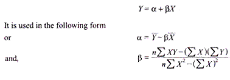

## Risk and Returns ##

After investing money in a project a firm wants to get some outcomes from the project. The outcomes or the benefits that the investment generates are called returns. Wealth maximization approach is based on the concept of future value of expected cash flows from a prospective project.

So cash flows are nothing but the earnings generated by the project that we refer to as returns. Since fixture is uncertain, so returns are associated with some degree of uncertainty. In other words there will be some variability in generating cash flows, which we call as risk. In this article we discuss the concepts of risk and returns as well as the relationship between them.

# Concept of Risk

A person making an investment expects to get some returns from the investment in the future. However, as future is uncertain, the future expected returns too are uncertain. It is the uncertainty associated with the returns from an investment that introduces a risk into a project. The expected return is the uncertain future return that a firm expects to get from its project. The realized return, on the contrary, is the certain return that a firm has actually earned.

The realized return from the project may not correspond to the expected return. This possibility of variation of the actual return from the expected return is termed as risk. Risk is the variability in the expected return from a project. In other words, it is the degree of deviation from expected return. Risk is associated with the possibility that realized returns will be less than the returns that were expected. So, when realizations correspond to expectations exactly, there would be no risk.

## Elements of Risk

Various components cause the variability in expected returns, which are known as elements of risk. There are broadly two groups of elements classified as systematic risk and unsystematic risk.

### Systematic Risk

Business organizations are part of society that is dynamic. Various changes occur in a society like economic, political and social systems that have influence on the performance of companies and thereby on their expected returns. These changes affect all organizations to varying degrees. Hence the impact of these changes is system-wide and the portion of total variability in returns caused by such across the board factors is referred to as systematic risk. These risks are further subdivided into interest rate risk, market risk, and purchasing power risk.

### Unsystematic Risk

The returns of a company may vary due to certain factors that affect only that company. Examples of such factors are raw material scarcity, labour strike, management ineffi­ciency, etc. When the variability in returns occurs due to such firm-specific factors it is known as unsystematic risk. This risk is unique or peculiar to a specific organization and affects it in addition to the systematic risk. These risks are subdivided into business risk and financial risk.

## Measurement of Risk

Quantification of risk is known as measurement of risk. Two approaches are followed in measurement of risk.

1. Mean-variance approach

2. Correlation or regression approach

Mean-variance approach is used to measure the total risk, i.e. sum of systematic and unsystematic risks. Under this approach the variance and standard deviation measure the extent of variability of possible returns from the expected return and is calculated as:

> 
>
> Where,
>
> Xi = Possible return
> 
> P = Probability of return
> 
> n = Number of possible returns.

Correlation or regression method is used to measure the systematic risk. Systematic risk is expressed by β and is calculated by the following formula:

> 
>
> Where, rim = Correlation coefficient between the returns of stock i and the return of the market index,
> 
> σm = Standard deviation of returns of the market index, and
> 
> σi = Standard deviation of returns of stock i.

Using regression method we may measure the systematic risk.

The form of the regression equation is as follows:

> Where, n = Number of items,
> 
> Y = Mean value of the company’s return,
> 
> X = Mean value of return of the market index,
> 
> α = Estimated return of the security when the market is stationary, and
> 
> β = Change in the return of the individual security in response to unit change in the return of the market index.

# Concept of Return

Return can be defined as the actual income from a project as well as appreciation in the value of capital. Thus there are two components in return—the basic component or the periodic cash flows from the investment, either in the form of interest or dividends; and the change in the price of the asset, com­monly called as the capital gain or loss.

The term yield is often used in connection to return, which refers to the income component in relation to some price for the asset. The total return of an asset for the holding period relates to all the cash flows received by an investor during any designated time period to the amount of money invested in the asset.

It is measured as, `Total Return = Cash payments received + Price change in assets over the period /Purchase price of the asset`. In connection with return we use two terms—realized return and expected or predicted return. Realized return is the return that was earned by the firm, so it is historic. Expected or predicted return is the return the firm anticipates to earn from an asset over some future period.