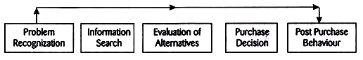

## Consumer Behaviour ##

- [Meaning and Definition](#meaning-and-definition)
- [Nature of Consumer Behaviour](#nature-of-consumer-behaviour)
  - [Influenced by various factors](#influenced-by-various-factors)
  - [Undergoes a constant change](#undergoes-a-constant-change)
  - [Varies from consumer to consumer](#varies-from-consumer-to-consumer)
  - [Varies from region to region and country to county](#varies-from-region-to-region-and-country-to-county)
  - [Information on consumer behaviour is important to the marketers](#information-on-consumer-behaviour-is-important-to-the-marketers)
  - [Leads to purchase decision](#leads-to-purchase-decision)
  - [Varies from product to product](#varies-from-product-to-product)
  - [Improves standard of living](#improves-standard-of-living)
  - [Reflects status](#reflects-status)
- [Consumer Buying Process](#consumer-buying-process)
  - [Problem Identification](#problem-identification)
  - [Information Search](#information-search)
    - [Personal Sources](#personal-sources)
    - [Commercial Sources](#commercial-sources)
    - [Public Sources](#public-sources)
    - [Experimental Sources](#experimental-sources)
  - [Evaluation of Alternatives](#evaluation-of-alternatives)
  - [Purchase Decision](#purchase-decision)
  - [Post-purchase Decisions](#post-purchase-decisions)
    - [Post-purchase Satisfaction](#post-purchase-satisfaction)
    - [Post-purchase Action](#post-purchase-action)
    - [Post-purchase Use and Disposal](#post-purchase-use-and-disposal)
- [Determinants of Consumer Behaviour](#determinants-of-consumer-behaviour)
  - [Economic Determinants](#economic-determinants)
    - [Personal income](#personal-income)
    - [Family income](#family-income)
    - [Consumer income expectations](#consumer-income-expectations)
    - [Consumer liquid assets](#consumer-liquid-assets)
    - [Consumer credit](#consumer-credit)
    - [The level of standard of living](#the-level-of-standard-of-living)
  - [Psychological Determinants](#psychological-determinants)
    - [Motivation](#motivation)
    - [Perception](#perception)
    - [Learning](#learning)
    - [Attitude](#attitude)
    - [Personality](#personality)
  - [Sociological Determinants](#sociological-determinants)
    - [Family](#family)
    - [Reference groups](#reference-groups)
    - [Opinion leaders](#opinion-leaders)
    - [Social class and caste](#social-class-and-caste)
    - [Culture](#culture)
  

# Meaning and Definition

Consumer behaviour is the study of how individual customers, groups or organizations select, buy, use, and dispose ideas, goods, and services to satisfy their needs and wants. It refers to the actions of the consumers in the marketplace and the underlying motives for those actions.

Marketers expect that by understanding what causes the consumers to buy particular goods and services, they will be able to determine—which products are needed in the marketplace, which are obsolete, and how best to present the goods to the consumers.

The study of consumer behaviour assumes that the consumers are actors in the marketplace. The per­spective of role theory assumes that consumers play various roles in the marketplace. Starting from the information provider, from the user to the payer and to the disposer, consumers play these roles in the decision process.

The roles also vary in different consumption situations; for example, a mother plays the role of an influencer in a child’s purchase process, whereas she plays the role of a disposer for the products consumed by the family.

According to Engel, Blackwell, and Mansard, 

> "consumer behaviour is the actions and decision processes of people who purchase goods and services for personal consumption."

According to Louden and Bitta,

> "consumer behaviour is the decision process and physical activity, which individuals engage in when evaluating, acquiring, using or disposing of goods and services"

# Nature of Consumer Behaviour

## Influenced by various factors

The various factors that influence the consumer behaviour are as follows:

- Marketing factors such as product design, price, promotion, packaging, positioning and dis­tribution.

-  Personal factors such as age, gender, education and income level.

- Psychological factors such as buying motives, perception of the product and attitudes towards the product.

- Situational factors such as physical surroundings at the time of purchase, social surroundings and time factor.

- Social factors such as social status, reference groups and family.

- Cultural factors, such as religion, social class—caste and sub-castes.

## Undergoes a constant change

Consumer behaviour is not static. It undergoes a change over a period of time depending on the nature of products. For example, kids prefer colourful and fancy footwear, but as they grow up as teenagers and young adults, they prefer trendy footwear, and as middle-aged and senior citizens they prefer more sober footwear. The change in buying behaviour may take place due to several other factors such as increase in income level, education level and marketing factors.

## Varies from consumer to consumer

All consumers do not behave in the same manner. Differ­ent consumers behave differently. The differences in consumer behaviour are due to individual factors such as the nature of the consumers, lifestyle and culture. For example, some consumers are technoholics. They go on a shopping and spend beyond their means.

They borrow money from friends, relatives, banks, and at times even adopt unethical means to spend on shopping of advance technologies. But there are other consumers who, despite having surplus money, do not go even for the regular purchases and avoid use and purchase of advance technologies.

## Varies from region to region and country to county

The consumer behaviour varies across states, regions and countries. For example, the behaviour of the urban consumers is different from that of the rural consumers. A good number of rural consumers are conservative in their buying behaviours.

The rich rural consumers may think twice to spend on luxuries despite hav­ing sufficient funds, whereas the urban consumers may even take bank loans to buy luxury items such as cars and household appliances. The consumer behaviour may also varies across the states, regions and countries. It may differ depending on the upbringing, lifestyles and level of development.

## Information on consumer behaviour is important to the marketers

Marketers need to have a good knowledge of the consumer behaviour. They need to study the various factors that influence the consumer behaviour of their target customers.

The knowledge of consumer behaviour enables them to take appropriate marketing decisions in respect of the following factors:

  - Product design/model
  
  - Pricing of the product
  
  - Promotion of the product
  
  - Packaging
  
  - Positioning
  
  - Place of distribution

## Leads to purchase decision

A positive consumer behaviour leads to a purchase decision. A consumer may take the decision of buying a product on the basis of different buying motives. The purchase decision leads to higher demand, and the sales of the marketers increase. Therefore, marketers need to influence consumer behaviour to increase their purchases.

## Varies from product to product

Consumer behaviour is different for different products. There are some consumers who may buy more quantity of certain items and very low or no quantity of other items. For example, teenagers may spend heavily on products such as cell phones and branded wears for snob appeal, but may not spend on general and academic reading. A middle- aged person may spend less on clothing, but may invest money in savings, insurance schemes, pension schemes, and so on.

## Improves standard of living

The buying behaviour of the consumers may lead to higher stan­dard of living. The more a person buys the goods and services, the higher is the standard of living. But if a person spends less on goods and services, despite having a good income, they deprives themselves of higher standard of living.

## Reflects status

The consumer behaviour is not only influenced by the status of a consumer, but it also reflects it. The consumers who own luxury cars, watches and other items are considered belonging to a higher status. The luxury items also give a sense of pride to the owners.

# Consumer Buying Process

Simply, we can define the term as: Consumer buying process consists of sequential steps the consumer follows to arrive at the final buying decisions. Mostly, consumers follow a typical buying process. Marketer must know how consumers reach the final decision to buy the product. According to Philip Kotler, the manager can learn about the stages in the buying process through four methods. Each method gives hint regarding the steps in the consumer buying process.

According to Philip Kotler, the typical buying process involves five stages the consumer passes through described as under:

## Problem Identification

This step is also known as recognizing of unmet need. The need is a source or force of buying behaviour. Buying problem arises only when there is unmet need or problem is recognized. Need or problem impels an individual to act or to buy the product.

Buyer senses a difference between his actual state (physical and mental) and a desired state. The need can be triggered by internal or external stimuli. Internal stimuli include basic or normal needs – hunger, thirst, sex, or comfort; while external stimuli include external forces, for instance, when an individual watch a new brand car, he desires to buy it.

Marketer must identify the circumstances that trigger a particular need. He can collect information from a number of consumers regarding how stimuli spark an interest in products. Based on information, he can develop marketing strategies to trigger consumer interest.

## Information Search

Interested consumer will try to seek information. Now, he will read newspapers and magazines, watch television, visit showroom or dealer, contact salesman, discuss with friends and relatives, and try all the possible sources of information.

Mostly, the consumer can try one or more of following sources of information:

### Personal Sources

They may include family members, friends, package, colleagues, and relatives.

### Commercial Sources

Advertising, salesmen, dealers, package, trade show, display, and exhibition are dominant commercial sources.

### Public Sources

Mass media (radio, TV, newspapers, magazines, cinema, etc.), consumer- rating agencies, etc., are main public sources.

### Experimental Sources

They include handling, examining, testing, or using the product. Selection of sources depends upon personal characteristics, types of products, and capacity and reliability of sources. Each information source performs different functions in influencing buying decision. By gathering information from relevant sources, the consumer can learn about different products and brands available in the market.

Note that consumer will not collect detail information on all the brands available in the market. He scrutinizes all the brands in sequence, like total (brands) set to awareness set to affordable set, and to choice set. Consumer collects information only on limited brands, say, choice set.

Marketer must try to get his brand into the prospects’ awareness set and choice set. Moreover, the company should identify sources and their relative importance. Company must ask the consumers regarding types of sources they exercise. They can elicit valuable information about sources they normally use and their relative value. On that basis, effective communication can be prepared for the target market.

## Evaluation of Alternatives

In the former stage, the consumer has collected information about certain brands. Now, he undergoes evaluation of brands. He cannot buy all of them. Normally, he selects the best one, the brand that offers maximum satisfaction. Here, he evaluates competitive brands to judge which one is the best, the most attractive. Evaluation calls for evaluating various alternatives with certain choice criteria.

Following criteria are considered while evaluating alternatives:

1. Benefits offered by the brands

2. Qualities, features or attributes, and performance

3. Price changed by various brands

4. History of brands

5. Popularity, image or reputation of brands

6. Product-related services offered by the brands, such as after-sales services, warrantee, and free installation

7. Availability of brands and dealer rating.

Different criteria are used for different products. For example, if a person wants to purchase a motorbike out of Enfield Bullet 350; TVS Victor, TVS Centra, Suzuki Ferro; Hero Honda Spender, Ambition, and CBZ; Kawasaki Bajaj Boxer, Pulsar and Caliber; LML Freedom, etc., he will consider following criteria:

1. Price

2. Pick-up and performance

3. Facilities and comfort

4. Gear-transmission system

5. Get-up/appearance

6. Speed per hour

7. Average per liter petrol

8. Maintenance costs

9. Image, status and novelty

10. Safety

11. Resale value

12. Services, guarantee, warrantee, etc.

The brand that meets most of the above conditions reasonably is more likely to be preferred. Marketer should highlights superior features of his brand. Some companies also advertise comparative table to help consumers evaluate various brands. For example, Yamaha, Maruti, and Hyundai provide comparative table in newspapers to show how the bike/car is superior to other brands.

## Purchase Decision

This is the stage when the consumer prefers one, the most promising band, out of several brands. The former stage helps consumers evaluate various brands in the choice set. The brand that offers maximum benefits or satisfaction is preferred.

Simply, the most attractive brand, that can offer more benefits in relation to price paid, is selected by comparing one brand with others. Comparison shows superiority/inferiority of the brands.

Now, consumer makes up his mind to purchase the most preferred brand. However, three factors further affect whether buying intension result into actual purchase. More clearly, the consumer’ decision to avoid, modify, or postpone a purchase decision is influenced by these factors.

The first factor is attitudes of others. The impact of other persons’ attitudes depends on degree of their negative attitudes toward the consumer’s preferred brand, and consumer’s degree of compliance with other persons’ wishes.

The second factor is unanticipated situational factors. Purchase intension may change due to certain unanticipated situational factors like price hike, loss of job, family income, major medical expenses, non-availability of the preferred brand, or such similar factors.

The third and the last factor is consumer’s perceived risk. Degree of risk depends on price, attribute uncertainty, entry of a new superior product, and his self-confidence.

**Sub-decisions in Purchase Decision:**

Consumer’s buying decision involves following five sub-decisions:

1. Brand Decision: 
For example, CBZ (model) motorbike of Hero Honda.

2. Vender Decision:
For example, XYZ Hero Honda Showroom.

3. Quantity Decision:
For example, one motorbike.

4. Timing Decision:
For example, on 1st December, 2007.

5. Payment Decision:
For example, by cash.

## Post-purchase Decisions

Consumer buys the product with certain expectations. Though he decides very systematically, there is no guarantee of a complete satisfaction. There is always possibility of variation between the expected level of satisfaction and the actual satisfaction. His subsequent behaviour is influenced by degree of satisfaction/dissatisfaction.

Marketer must monitor the post-purchase experience of the buyers that includes:

- [Post-purchase Satisfaction](#post-purchase-satisfaction)

- [Post-purchase Action](#post-purchase-action)

- [Post-purchase Use and Disposal](#post-purchase-use-and-disposal)

### Post-purchase Satisfaction

Actual satisfaction may not be equal to the expected one. He may find some problems or defects in the product while using. It is the matter of interest for marketer to know whether consumer is highly satisfied, somewhat satisfied, or dissatisfied. Consumer’s satisfaction is the function of the relationship between expected/perceived performance (expectations) and actual performance.

The larger the gap between expectations and performance, the greater the consumer’s dissatisfaction will be. The consumer is satisfied when product meets or exceeds all the expectations and vice versa. If he is satisfied, he buys the product again, and talks favourably. In order to minimize the gap between expectations and performance, the seller must not exaggerate the product benefits; must make truthful claim of product’s likely performance.

### Post-purchase Action

Obviously, level of the consumer’s satisfaction with the product affects his subsequent behaviour/action. If he is satisfied reasonably, he purchases the product again, and talks favourably to family members, friends, relatives, and co-workers.

That is why marketer says: Our best advertisement is a satisfied consumer. Quite opposite to it, dissatisfied consumer responds differently. He may abandon product, complain to the company for compensation, resort to the court and warn other organisations, friends, relatives and co-workers to avoid product. The task of marketer consists of taking certain steps to minimize amount of consumer’s post-purchase dissatisfaction.

Dissatisfaction can be reduced by:

1. Congratulating consumers for the right choice to justify their decision

2. Sending booklet to guide for effective use of the product

3. Inviting suggestions from consumers

4. Managing complaints by effective counseling and after-sales services

5. Informing about changes made in the product

6. Exchanging or returning amount, etc.

He must investigate where the product falls short. Close informal relations with consumers can yield valuable information. Remember that a dissatisfied consumer is more important than a satisfied one as his every problem regarding the product reveals a ready suggestion. Marketer must welcome complaints and tackle them carefully for the bright future.

### Post-purchase Use and Disposal

Marketer should also monitor how the consumers use and dispose the product. Such information can be a very good guideline for the marketer. Marketer can learn possible problems and opportunities relating with the product.

In normal situation, the consumer uses or disposes the product in followings ways:

1. He may not use the product immediately; store it for the future use.

2. Use the product fully immediately after purchase.

3. Resell or trade it.

4. Use the product differently than it is meant for. He may find new uses of the product.

5. Offer the product to others as a gift.

6. Throw the product away, considering as useless.

Marketer can change or modify marketing programme based on the study of how the product is used and disposed. In case, when consumers are much creative, it is important to investigate how the product is used or disposed.

Thus, buying process is a journey from problem recognition to reaction of buyers. The entire process is very meaningful to the seller. The process reflects most of factors affecting consumers. Marketer, therefore, must study the buying process from consumer’s viewpoint. Company must take certain steps to support consumers in each stage to buy its product.

# Determinants of Consumer Behaviour

The determinants of consumer behaviour can be grouped into three major captions namely, economic, psychological and sociological. An attempt is made to elucidate these with least complications.

## Economic Determinants
Economic scientists were the first among social scientists to study consumers and their behaviour and provided the details about the solutions to the consumer and consumption problems. Economists, as we are aware, took man as a social and rational animal.

The basic economic determinants among others are:

### Personal income

One’s income is the reward for one’s economic efforts. Income means purchasing power. When we talk of income in marketing sense, we are more concerned with ‘disposable income’ and “discretionary income’.

‘Disposable income’ is the amount of money that a consumer has at his disposal for spending or saving or both. In other words, of the total gross income, whatever balance remains after meeting pre­emptive demands like taxes, debt repayment and debt servicing charges and the like.

Any change in disposable income will have change in consumer buying decisions. Decline in disposable income reduces the consumer spending; however, when disposable income rises, consumer spending not only rises but makes them to go in for more of luxuries.

In other words, disposable income causes change in the relative demand for different categories of products and services. On the other hand, ‘discretionary income’ is the income which is available after meeting the basic needs of living.

It is the residual disposable income left after meeting all the expenses essential to provide a minimum subsistence needs to a family. Discretionary income changes have their own implications.

A rise in discretionary income results in usually an increased spending by consumers on those items that raise their living standards. Therefore, a continuous rise in the discretionary income is likely to change the very life-style of the consumers.

### Family income

Where a consumer is the member of a joint family, the buyer behaviour is influenced by the family income rather than the individual income. It does not mean that one can ignore the individual income, for family income is the aggregate of individual income of all the members of the family.

In a joint family, it may so happen that a rise in an individual member’s income may be neutralised by a fall in another member’s income. That is why; it is the relationship between the family size or the requirements and the income that finally determines the buying behaviour or the family members.

### Consumer income expectations

Many a times, it is the future income expectations of the consumer that influences such consumer behaviour. It is the optimism or the pessimism about consumer income that determines the level of current spending.

If there are bleak prospects of future expected income, he spends less now and saves more and vice versa. It is worth the noting here that the force and vitality of a tendency to spend or save depends on the nature of consumer needs.

In case of basic needs of living, such tendency will be too weak for no consumer denies the minimum subsistence level merely because to bleak future income expectations. However, in case of non-essential goods, such tendency may be very strong to save than to spend if he is expecting weak future income generation and vice versa.

### Consumer liquid assets

It is the consumer liquid asset position that influences the consumer behaviour. Liquid assets of consumers are the assets held in the money or near-money forms of investments. The best examples of this kind are hard cash, bank balance, bank deposits, shares and bonds and saving certificates. These assets are built up to buy some consumer durables or to meet unexpected future needs or contingencies.

If a person has more such liquid assets, more carefree he comes in spending the current or the regular income.

### Consumer credit

Availability or paucity of consumer credit has its impact on consumer buying behaviour. Consumer credit is a facility extended by a market to postpone the payment of products bought to some future date.

Consumer credit takes number of shapes like deferred payment, instalment purchasing, hire-purchase arrangements and the like. Easy availability of consumer credit makes the consumer to go in for those consumer durables which he would have postponed otherwise. Further, it makes him to spend more freely the current income.

### The level of standard of living

The consumer behaviour has the impact of the established standard of living to which he is accustomed. Even if consumer income goes down, the consumer spending will not come down proportionately because, it is very difficult to come down from an established standard of living.

On the other hand, rise in income tends to improve upon the established standard of living. In case the income falls, the short-fall is made good by borrowings to a certain extend over a short period of time.

## Psychological Determinants

Psychologists have also provided certain clues as to why a consumer behaves this way or that way. The major psychological determinants internal to the individual are motivation perception learning, attitude and personality.

Here is an attempt to explain and to know their implications in so far as consumer behaviour is concerned.

### Motivation

Motivation is the ‘why’ of behaviour. It is an intervening variable between stimulus and response and a governing force of consumer behaviour.

“Motivation refers to the drives, urges, wishes or desires which initiate the sequence of events known as behaviour.” as defined by Professor M.C. Burk. Motivation is an active, strong driving force that exists to reduce a state of tension and to protect, satisfy and enhance the individual and his self-concept. It is one that leads the individual to act in a particular way. It is the complex net-work of psychological and physiological mechanisms.

Therefore, motives can be conscious or unconscious, rational or emotional, positive or negative. These motives range from a mere biological desires like hunger and thirst to the most advanced scientific pursuits like landing on the Moon or Mars.

It was Abraham Maslow who developed five steps human need hierarchy those of survival-Safety Belongingness and Love-Easteem and Self Actualisation.

According to him, fulfillment of one will lead to the fulfillment of higher motives. The implications are that as we move up in the ladder, the input of marketing becomes more and more deep and subtle.

### Perception

Marketing management is concerned with the understanding of the process of perception because, perception leads to thought and thought leads to action. Perception is the process whereby stimuli are received and interpreted by the individual and translated into a response.

In other words, perception is the process by which the mind receives, organises and interprets physical stimuli. To perceive is to see, hear, touch, taste, smell and sense internally something or some event or some relation.

Perception is selective because, and individual cannot possibly perceive all stimulus objects within his perceptional field; hence, he perceives selectively. Perception is organized because, perceptions have meaning for the individual and they do not represent a buzzing confusion. Perception depends upon stimulus factors. That is, the nature of physical stimulus itself is a determinant of perception.

The variables like colour size, contrast, intensity, frequency and movement are of this kind. Again, perception depends on the personal factors. What the individual brings to the situation governs perception his ability to see or hear the message, his needs, his moods, memory, expressions and values all these modify the message reception.

The personal factor of perception is his self concept, need, span of apprehension, mental set and the past experiences.

Perception has its own impact on consumer behaviour or consumer decision-making. Let us take some such cases:

**Perception and communication:**

It is estimated that 90 per cent of the stimuli that the individuals perceive come through sight and rest from hearing. That is why, advertisements bank heavily audio on visual stimuli.

However, it does not mean that loud noises, bright colours and large ads themselves guarantee consumer attention and response. Contrary to this, it is the use of haunting melodies, pastel shades, regional accents and careful adjustment of ad size in relation to the total page or poster size all affect perception and these factors may give better results.

**Product and brand perception:**

Good many studies have been made of the ways in which the consumers perceive the products and the brands they choose regularly. It is brand images and the brand differentiation that play vital role in perception in addition to the physical characteristics of the product. Therefore, it is a must for a marketer to examine all the factors that impinge on the construction of a brand image to ascertain their effects on consumer perception of the company’s marketing mix.

**Price perception:**

Price is another element of marketing mix where perception has its implications. Studies have proved beyond doubt that consumers judge product or service quality by price. ‘Higher the price better the quality’ that goes.

This goes on establishing that there is going to the direct or positive relationship between price and demand where marketer is cared to gain. Another aspect of this price perception is psychological pricing.

The reasoning behind such pricing strategies is that consumers are likely to perceive used in cut-price sales promotions to increase the feeling that a price has been drastically reduced.

**Store perception:**

There are five major components of stores image namely, location design-product assortment-services and personnel each of which contributes to consumer perception of the place from which he or she buys.

Mere physical attributes do to talk of a store image. Other intangible factors, too, influence consumer perception of stores image such as advertising, inter-personal communication and experience.

Consumer perceptions of stores are greatly influenced by consumer’s own self- perception and motives. Further, consumer’s self-images influence the places in which they shop.

**Perceived risk:**

The concept of perceived-risk recognizes that consumer experiences a sense of risk in purchase and that consumer behaviour can be studied profitably as a risk reducing behaviour.

Consumer behaviour involves risk in the sense that any action of a consumer will produce results which he cannot predict with certainty. The perception of risk in a purchase situation is a function of the possible consequences and the product uncertainty involved. Perceived risk can be divided into forms namely, ‘functional’ and ‘psychological’.

Functional risk is related with the performance and the psychosocial risk is related with the fact whether the product enhances one’s sense of well being or self-concept.

The level of perceived risk is a function of the uncertainty involved and the possible consequences of purchase and can be reduced by gaining greater certainty or by minimising consequences. In most cases, it is increasing the element of certainty.

### Learning

In behavioural science, learning means any change in behaviour which comes about as a result of experience. Learning is the process of acquiring knowledge. Consumer behaviour is a process of learning because; it is modified according to the customer’s past experience and the objectives he or she has set. This process of learning is made up of four stages namely, Drive- cue-response and Reinforcement. ‘Drive’ refers to an internal state of tension which warrants action.

Thus, hunger or thirst can be a drive. A ‘cue’ is an environmental stimulus. For instance, it can be an ad on food item or soft- drink, ‘Response’ represents the person’s reaction to cues within his environment. Here, it can be purchased of food item or soft-drink. ‘Reinforcement’ is the responses reward.

The food item or soft-drink. ‘Reinforcement’ is the response reward. The food item or soft drink satisfies the hunger or the thirst. When reinforcement happens, the response may be duplicated resulting in habit formation or absence of reinforcement results in extinction of learnt habit.

As most consumer behaviour is learnt behaviour, it has deep impact on consumer buying process. Prior experience and learning acts as buying guide. In-spite of such habitual behaviour, one can think of reasonable amount of brand switching, trying new products, does take place.

The strong tendency of most consumers to develop brand loyalties definitely benefits the makers of established brands. This makes the manufacturer of a new brand to face difficulty in breaking such loyalties and encouraging brand switching.

He succeeds in his efforts when he shows that his product is potentially much more satisfying than his competitors. Free sampling, in store trial and demonstrations and deal activities may be used to break the existing brand barrier to establish new patterns of purchase behaviour.

To the extent the learning and brand loyalty can be gained for a product, the manufacturer activates a more stable sales profile less vulnerable to the competitive inroads.

### Attitude

The concept of attitude occupies a central position in the consumer behaviour studies in particular and social psychology in general because; attitude measurements help in understanding and prediction of consumer behaviour. ‘Attitude’ refers to a predisposition to behave in a particular way when presented with a given stimulus and the attitudes towards people, places, products and things can be positive or negative or favourable or unfavourable.

Attitudes develop gradually as a result of experience; they emerge from interaction of a person with family, friends, and reference groups. There are three distinct components of attitude namely, cognitive, affective and co-native. ‘Cognitive’ component is what an individual believes about an object, thing or an event whether it is good or bad, necessary or unnecessary, useful or useless.

It is based on the reason and is linked with knowledge and about the object, thing or an event whether it is pleasant or unpleasant, tasty how an individual responds to the object, thing or an event. It is based on the other two components and is related with his behaviour.

Each of the three attitude components vary according to both the situation and the person. The marketing manager’s success is determined partly by his ability to understand, predict and influence the consumer attitudes.

The marketer may be interested in confirming the existing attitudes, or change in the existing attitudes or create new attitudes depending on how his product is performing in the market.

Attitude confirmation is, perhaps, the easiest course of action which is followed in case of established products. Such an act involves only reminding the consumers as to why they like it and why they should continue it to purchase.

Attitude changing is more difficult task than mere confirming it. It is a change from disposition to act in the direction of the original attitude to a disposition to act in the opposite direction.

A product disliked is to be liked by the consumers. It is really a difficult process. Attitude creation is to make the consumers to forget the old products or brands and to make them to go in for new product or brand entirely altogether, in fact, it is comparatively easier to create new attitudes than to change the existing one. The most powerful instrument of attitude change and creation is advertising.

### Personality

Very often, the word ‘personality’ is used to refer to the capacity of a person for popularity, friendliness or charisma. However, in strict sense, it refers to the essential differences between one individual and another.

Therefore, personality consists of the mannerisms, habits and actions that make a person an individual and thereby serve to make him distinct from everyone else. It is the function of innate drives, learned motives and experience.

This means that an individual responds with certain amount of consistency to similar stimuli. Personality is the interplay of three components namely, ‘id’, ‘the ego’ and the ‘super ego’.

The ‘id’ governs the basic drives and the instincts of an individual. On the other hand, the ‘super ego’ disciplines the ‘id’ by suppressing anti-social behaviour; it drives the individual in the direction of more high minded pursuits of civilizations.

The ‘ego’ component is the executive and makes the conscious decisions and reconciles the inflicting demands of ‘id’ and ‘super ego’, wherever necessary. For instance, ‘id’ may force an individual to make full use of consumer credit to buy an automobile, ‘super ego’ dissuades such an activity as borrowing is a kind of social sin in Indian society.

It is ‘ego’ that reconciles these and works out a compromise making the individual to pay instalments regularly without any strain on his regular budget.

The personality of an individual is either expressed in terms of traits or type. The personality traits may be aggressiveness honesty anxiety independence sociability and so on.

The personality types may be introvert or extrovert or another classification as tradition direction outer direction and inner direction. Each of these traits and types has been explored as the possible clues to the behaviour of consumers.

Evaluation of personality’s role in marketing is seen in drawing consumer profiles and psychographic market segmentation.

## Sociological Determinants

In the area of psychological determinants, the consumer behaviour was seen from the stand point view of an individual. However, the sociologists and social psychologists have attempted to explain the behaviour of a group of individuals and the way in which it affects and conditions and individual’s behaviour in marketing or purchase decisions.

These groups of individuals as determinants are:

1. [Family](#family)

2. [Reference groups](#reference-groups)

3. [Opinion leaders](#opinion-leaders)

4. [Social class and Caste](#social-class-and-caste)

5. [Culture](#culture)

Let us see these in brief to know their marketing implications:

### Family

Many of the decisions made by consumers are taken within the environment of the family and are affected by the desires, attitudes, and values of the other family members. Family, as a primary group, is vital because, it links the individual with a wider society and it is through this that the individual learns the roles appropriate to the adult life. The family can be ‘nuclear’ or ‘extended’.

A ‘nuclear’ family is a two generational family which consists, usually, a mother-father and children. The ‘extended’ family is one that spans at-least three generations which consists of mother-father- children-grandparents uncle-aunts, cousins-nephews and other in-laws. There is another way of classifying the family based on family life-cycle.

This classification is ‘home making phase’ from marriage to birth of the first child; the ‘procreation phase’ from the birth of the first child to the marriage of the first child’s; the dispersion phase’ from the marriage of the first child to the marriage of the last and the ‘final phase’ from the marriage of the last child to the death of original partners.

The family impact on consumer buying behaviour can be traced in two ways:

1. The family influence on the individual personality characteristics, attitudes and the evaluative criteria and

2. The family influence in the decision-making process involved in the purchases. Family is both a purchasing and consuming unit. Therefore, it is essential to note the distinguished family roles of the members.

These roles are:

1. **Initiator:** The person who senses the need for the purchase;

2. **Influencer:** The person who provides input into the purchase decision;

3. **Decider:** The person who has the final say over the decision and

4. **User:** The person who is most directly involved in using the purchase.

That is why; every marketer is keenly interested in four points in case of family purchase. There are:

1. Who influences the buying?

2. Who does family buying?

3. Who makes buying decision?

4. Who uses the product?

In nuclear families, it is mostly the house-wife that has an upper hand in family purchases regarding her family role such as food, clothing, cosmetics, interior decoration and jewelleries.

Father has say over clothing, education, insurance etc., The children have say in clothes, sports-equipments and recreational facilities such as TV, stereo-sets and the like.

Family life-cycle also has its own influence on buying behaviour. Thus, the proportion of a family budget spent on food, clothing and children goes on increasing in the ‘procreation stage’ than in ‘home making stage’.

### Reference groups

Each person in the society is not only the member of his family but the member of some group or groups outside the family circle. These groups can be called as ‘reference groups’.

‘Reference groups’ are those groups which an individual identifies with to the extent that these groups become a standard or norm which influences his behaviour.

Reference group is a social and professional group that influences the individual’s opinions, beliefs and aspirations. It is one that provides an individual with a sense of identity, accomplishment and stability.

Generally, a person refers to any one of the following types of reference groups in building his or her behaviour.

**A. The groups that serve as comparison points:**

Here, the individual compares himself, his attitudes, his behaviour and his performance with the group of members. Thus, he may feel poor if members are richer than himself or vice versa.

**B. Groups to which a person aspires to belong:**

Here, the individual aspires to be the member of such group and imitates the behaviour of that group including buying behaviour. Thus, the group may be of higher social status or a cult group such as ‘hippies’ or the ‘jet-set’.

**C. Groups whose social perspectives are assumed by the individual as a frame-work of reference for his own actions:**

Here, an individual may adopt the views of the group without becoming a member. A person need not be a professional sportsman to have the opinion and outlook of a professional sportsman.

Some non-military persons behave more than ‘military’ personnel. Similarly, a person belonging to minority may adopt the values and the perspectives of a majority which he dislikes by very nature.

Consumers as social animals spend most of their time in group situations, and accept information provided by their groups on products, price, performance, style and the like.

It is group norms that direct the attention of its members towards a new product, a new brand. These reference groups have face to face interactions that provide word of mouth communication which is more powerful than formal advertising. A satisfied customer becomes the salesman of the product.

### Opinion leaders

Like reference groups, ‘opinion leaders’ or ‘influentials’ play a key role in influencing the buying behaviour of their followers. Very often we come across situations where a person refers to an individual than a group in formulating his or her behaviour pattern. The individual to whom such reference is made by a person or persons is the opinion leader.

The beliefs, preferences, attitudes, actions and behaviour of the leader set a trend and a pattern for others to follow in given situation. In very intimate reference group, there is a reference person, an informal group leader.

The group of followers respects him and looks up to him. He is the innovator in the group of followers who respect him and look up to him. He is the innovator in the group who first tries new ideas and products and then propagates them to his followers.

Marketers very often try to catch hold of the opinion leaders through ads and other means of communication. If they succeed in selling their ideas and products to the opinion leaders, then they have sold it to the entire group of followers behind them.

### Social class and caste

Buying behaviour of individuals is also influenced by the social class and the caste to which they belong. Social class is a relatively permanent and homogeneous division of a society into which individuals or families sharing similar values, life-style, interests and behaviour can be categorized. Social class is a larger group than intimate group in structure.

Constitution of a social class is determined by the income, authority, power, ownership, life­styles, education, consumption patterns, occupation, type and place of residence of the individual members. In our country, we can think of three classes are as ‘rich’, ‘middle’ and ‘poor’. Caste, on the other hand, is the group of the membership by birth. It is not the wealth but the birth that decides his or her caste. These castes were based on activity specialisation of profession or occupation.

In our country, we have four such broad categorization as ‘Brahmins’ ‘Kshatriyas’ ‘Vaishyas’ and ‘Shudras’.

From the marketing stand point, both social class and caste frame are quite relevant as buyer behaviour is influenced by these. Each class and caste develops its own standards of style, living and behaviour patterns.

It is not a surprise, and then if the members of such a class select a particular brand of product, shops at a particular store which caters to their group norms.

This does not mean that all the members of the group buy the same products, same brands, or conform to same styles; however, more or less, it becomes a pattern with differential range of likings and leanings. Thus, ‘Shudras’ may not enter the restaurants where ‘Brahmins’ and ‘Kshatriyas’ enter, though the ‘shudras’ are not barred from entering.

It is because of income pattern and traditional respect for higher castes, for in the eyes of Indian Constitution, all are equal.

### Culture

Culture adds yet another dimension to the study of consumer behaviour. ‘Culture” refers to all those symbols, anti-factor and behavioural patterns which are passed on socially from one generation to the next.

It includes cognitive elements, beliefs, values, and norms, signs and non-normative behaviour. Cultures are specific to the areas in which they evolve. Yet two nations can enjoy a common cultural heritage. Thus, each nation has its distinct culture ; however, in a particular nation, there may be subcultures identified on the basis of ethnicity, nationality, religion and race.

Cultural and sub-cultural groups have their unique consumption patterns that provide important bases to the marketers.

Cultural trends have significant implications for market segmentation, product development, advertising, merchandising, branding and packaging. While designing the marketing-mix, it is but essential to determine the broad cultural values that are relevant to the product as well as the most effective means of conveying these values.

A shrewd marketer never contradicts these cultural values in product, promotion, price and distribution.