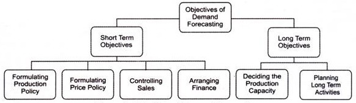
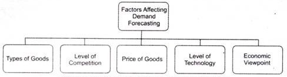

## Demand Forecasting ##

An organization faces several internal and external risks, such as high competition, failure of technology, labor unrest, inflation, recession, and change in government laws.

Therefore, most of the business decisions of an organization are made under the conditions of risk and uncertainty.

An organization can lessen the adverse effects of risks by determining the demand or sales prospects for its products and services in future. Demand forecasting is a systematic process that involves anticipating the demand for the product and services of an organization in future under a set of uncontrollable and competitive forces.

Some of the popular definitions of demand forecasting are as follows.

According to Evan J. Douglas,
> “Demand estimation (forecasting) may be defined as a process of finding values for demand in future time periods.”

In the words of Cundiff and Still,
> “Demand forecasting is an estimate of sales during a specified future period based on proposed marketing plan and a set of particular uncontrollable and competitive forces.”

Demand forecasting enables an organization to take various business decisions, such as planning the production process, purchasing raw materials, managing funds, and deciding the price of the product. An organization can forecast demand by making own estimates called guess estimate or taking the help of specialized consultants or market research agencies. Let us discuss the significance of demand forecasting in the next section.

# Significance of Demand Forecasting

Demand plays a crucial role in the management of every business. It helps an organization to reduce risks involved in business activities and make important business decisions. Apart from this, demand forecasting provides an insight into the organization’s capital investment and expansion decisions.

The significance of demand forecasting is shown in the following points.

1. ## Fulfilling objectives

    Implies that every business unit starts with certain pre-decided objectives. Demand forecasting helps in fulfilling these objectives. An organization estimates the current demand for its products and services in the market and move forward to achieve the set goals.

    For example, an organization has set a target of selling 50, 000 units of its products. In such a case, the organization would perform demand forecasting for its products. If the demand for the organization’s products is low, the organization would take corrective actions, so that the set objective can be achieved.

2. ## Preparing the budget

    Plays a crucial role in making budget by estimating costs and expected revenues. For instance, an organization has forecasted that the demand for its product, which is priced at Rs. 10, would be 10, 00, 00 units. In such a case, the total expected revenue would be 10* 100000 = Rs. 10, 00, 000. In this way, demand forecasting enables organizations to prepare their budget.

3. ## Stabilizing employment and production

    Helps an organization to control its production and recruitment activities. Producing according to the forecasted demand of products helps in avoiding the wastage of the resources of an organization. This further helps an organization to hire human resource according to requirement. For example, if an organization expects a rise in the demand for its products, it may opt for extra labor to fulfill the increased demand.

4. ## Expanding organizations

    Implies that demand forecasting helps in deciding about the expansion of the business of the organization. If the expected demand for products is higher, then the organization may plan to expand further. On the other hand, if the demand for products is expected to fall, the organization may cut down the investment in the business.

5. ## Taking Management Decisions

    Helps in making critical decisions, such as deciding the plant capacity, determining the requirement of raw material, and ensuring the availability of labor and capital.

6. ## Evaluating Performance

    Helps in making corrections. For example, if the demand for an organization’s products is less, it may take corrective actions and improve the level of demand by enhancing the quality of its products or spending more on advertisements.

7. ## Helping Government

    Enables the government to coordinate import and export activities and plan international trade.

# Objectives of Demand Forecasting

Demand forecasting constitutes an important part in making crucial business decisions.

The objectives of demand forecasting are divided into short and long-term objectives

## Short-term Objectives

1. ## Formulating production policy

    Helps in covering the gap between the demand and supply of the product. The demand forecasting helps in estimating the requirement of raw material in future, so that the regular supply of raw material can be maintained. It further helps in maximum utilization of resources as operations are planned according to forecasts. Similarly, human resource requirements are easily met with the help of demand forecasting.

2. ## Formulating price policy

    Refers to one of the most important objectives of demand forecasting. An organization sets prices of its products according to their demand. For example, if an economy enters into depression or recession phase, the demand for products falls. In such a case, the organization sets low prices of its products.

3. ## Controlling sales

    Helps in setting sales targets, which act as a basis for evaluating sales performance. An organization make demand forecasts for different regions and fix sales targets for each region accordingly

4. ## Arranging finance

    Implies that the financial requirements of the enterprise are estimated with the help of demand forecasting. This helps in ensuring proper liquidity within the organization.

## Long-term Objectives

1. Deciding the production capacity

    Implies that with the help of demand forecasting, an organization can determine the size of the plant required for production. The size of the plant should conform to the sales requirement of the organization.

2. Planning long-term activities

    Implies that demand forecasting helps in planning for long term. For example, if the forecasted demand for the organization’s products is high, then it may plan to invest in various expansion and development projects in the long term.

# Factors Influencing Demand Forecasting

Demand forecasting is a proactive process that helps in determining what products are needed where, when, and in what quantities. There are a number of factors that affect demand forecasting.

1. ## Types of Goods

    Affect the demand forecasting process to a larger extent. Goods can be producer’s goods, consumer goods, or services. Apart from this, goods can be established and new goods. Established goods are those goods which already exist in the market, whereas new goods are those which are yet to be introduced in the market.

    Information regarding the demand, substitutes and level of competition of goods is known only in case of established goods. On the other hand, it is difficult to forecast demand for the new goods. Therefore, forecasting is different for different types of goods.

2. ## Competition Level

    Influence the process of demand forecasting. In a highly competitive market, demand for products also depend on the number of competitors existing in the market. Moreover, in a highly competitive market, there is always a risk of new entrants. In such a case, demand forecasting becomes difficult and challenging.

3. ## Price of Goods

    Acts as a major factor that influences the demand forecasting process. The demand forecasts of organizations are highly affected by change in their pricing policies. In such a scenario, it is difficult to estimate the exact demand of products.

4. ## Level of Technology

    Constitutes an important factor in obtaining reliable demand forecasts. If there is a rapid change in technology, the existing technology or products may become obsolete. For example, there is a high decline in the demand of floppy disks with the introduction of compact disks (CDs) and pen drives for saving data in computer. In such a case, it is difficult to forecast demand for existing products in future.

5. ## Economic Viewpoint

    Play a crucial role in obtaining demand forecasts. For example, if there is a positive development in an economy, such as globalization and high level of investment, the demand forecasts of organizations would also be positive.

# Types of Forcast

Forecasts can be of three types, which are explained as follows

1. ## Short Period Forecasts

    Refer to the forecasts that are generally for one year and based upon the judgment of the experienced staff. Short period forecasts are important for deciding the production policy, price policy, credit policy, and distribution policy of the organization.

2. ## Long Period Forecasts

    Refer to the forecasts that are for a period of 5-10 years and based on scientific analysis and statistical methods. The forecasts help in deciding about the introduction of a new product, expansion of the business, or requirement of extra funds.

3. ## Very Long Period Forecasts

    Refer to the forecasts that are for a period of more than 10 years. These forecasts are carried to determine the growth of population, development of the economy, political situation in a country, and changes in international trade in future.

    Among the aforementioned forecasts, short period forecast deals with deviation in long period forecast. Therefore, short period forecasts are more accurate than long period forecasts.

4. ## Level of Forecasts

    Influences demand forecasting to a larger extent. A demand forecast can be carried at three levels, namely, macro level, industry level, and firm level. At macro level, forecasts are undertaken for general economic conditions, such as industrial production and allocation of national income. At the industry level, forecasts are prepared by trade associations and based on the statistical data.

    Moreover, at the industry level, forecasts deal with products whose sales are dependent on the specific policy of a particular industry. On the other hand, at the firm level, forecasts are done to estimate the demand of those products whose sales depends on the specific policy of a particular firm. A firm considers various factors, such as changes in income, consumer’s tastes and preferences, technology, and competitive strategies, while forecasting demand for its products.

5. ## Nature of Forecasts

    Constitutes an important factor that affects demand forecasting. A forecast can be specific or general. A general forecast provides a global picture of business environment, while a specific forecast provides an insight into the business environment in which an organization operates. Generally, organizations opt for both the forecasts together because over-generalization restricts accurate estimation of demand and too specific information provides an inadequate basis for planning and execution.

# Steps of Demand Forecasting

The Demand forecasting process of an organization can be effective only when it is conducted systematically and scientifically.

1. ## Setting the Objective

    Refers to first and foremost step of the demand forecasting process. An organization needs to clearly state the purpose of demand forecasting before initiating it.

    Setting objective of demand forecasting involves the following.

   - Deciding the time period of forecasting whether an organization should opt for short-term forecasting or long-term forecasting

   - Deciding whether to forecast the overall demand for a product in the market or only- for the organizations own products

   - Deciding whether to forecast the demand for the whole market or for the segment of the market

   - Deciding whether to forecast the market share of the organization

2. ## Determining Time Period

    Involves deciding the time perspective for demand forecasting. Demand can be forecasted for a long period or short period. In the short run, determinants of demand may not change significantly or may remain constant, whereas in the long run, there is a significant change in the determinants of demand. Therefore, an organization determines the time period on the basis of its set objectives.

3. ## Selecting a Method for Demand Forecasting

    Constitutes one of the most important steps of the demand forecasting process Demand can be forecasted by using various methods. The method of demand forecasting differs from organization to organization depending on the purpose of forecasting, time frame, and data requirement and its availability. Selecting the suitable method is necessary for saving time and cost and ensuring the reliability of the data.

4. ## Collecting Data

    Requires gathering primary or secondary data. Primary’ data refers to the data that is collected by researchers through observation, interviews, and questionnaires for a particular research. On the other hand, secondary data refers to the data that is collected in the past; but can be utilized in the present scenario/research work.

5. ## Estimating Results

    Involves making an estimate of the forecasted demand for predetermined years. The results should be easily interpreted and presented in a usable form. The results should be easy to understand by the readers or management of the organization.