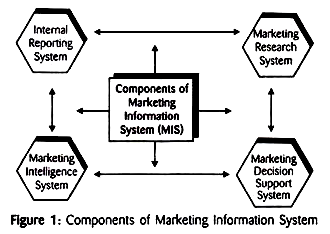

## Marketing Information System ##

*Marketing Information System (MIS) is a permanent arrangement (system or setup) for provision of regular availability of relevant, reliable, adequate, and timely information for making marketing decisions.*

Information is like a life-blood of business. Quality of decisions depends on the right type of information. The right information implies the right quality, the right quantity, and the right timing of information. Circulation of needed information is as important as the circulation of blood in human being.

Information keeps the organisation actively functioning, alive, and connected with internal and external marketing participants. It is a valuable asset for a firm as it is a base to manage other valuable assets. The firm fails to manage information (i.e., collecting, analyzing, interpreting, storing, and disseminating of information) will definitely fail to attain goals.

Today’s marketing is dynamic, and manager has to undergo necessary changes to cope with the pace of changing marketing environment. Information is a basic input to know what is happening and what is going to happen. Marion Harper has rightly asserted: “To manage a business well is to manage its future, and to manage the future well is to manage the information.”

A company needs information on a continuous basis to be aware of marketing developments taking place in the market. In order to learn about changing needs of customers, new competitors’ initiatives, changing distribution practices, recent trends in promotion practices, etc., a manager requires the permanent arrangement to get the needed information on a regular basis. The system or arrangement that deals with providing the information regularly is known as marketing information system (MIS).

# Definitions

> “A marketing information system is a continuing and interacting system of people, equipment’s, and procedures to gather, sort, analyze, evaluate, and distribute the pertinent, timely, and accurate information for use by marketing decision-makers to improve their marketing planning, implementation, and control.” Philip Kotler gives alternative definition, such as: “A marketing information system (MIS) consists of people, equipment’s, and procedures to gather, sort, analyze, evaluate, and distribute the needed, timely, and accurate information to marketing decision makers.”
> 
>  – Philip Kotler

Marketing Information System (MIS) is a permanent arrangement (system or setup) for provision of regular availability of relevant, reliable, adequate, and timely information for making marketing decisions.

MIS concerns with setting and maintaining of a permanent system (network) to avail necessary information on regular basis. The system consists of people, equipment’s, facilities, and procedures directed to gather, analyze, evaluate, update, distribute, and preserve the information to assist marketing decision-making, i.e., analyzing, planning, implementing, and controlling of marketing activities.

# Components of MIS

MIS is made of parts, subparts or subsystems which are called the components. Typically, according to Philip Kotler, a marketing information system consists of four interrelated components – Internal Reports (Records) System, Marketing Research System, Marketing Intelligence System, and Marketing Decision Support System, as shown in Figure 1. All components are interrelated and interdependent.

## Internal Records System

Internal records system is a major and easily accessible source of information. It supplies the results data. It consists of all records of marketing operations available within organisation. This system concerns with collecting, analyzing, interpreting, and distributing needed information from records of various departments of the company.

Main sources include various records on sales and purchase, ordering system, sales force reporting system, inventory level, receivable-payables, marketing staff, costs, the past research works, and other literatures/reports available within organisation. Particularly, for sales orders and sales force reporting, the computer technology is excessively used for accurate, efficient, and speedy transmission of information.

To manage the internal record system, some companies appoint internal MIS committee to deal with all aspects of internal information.

The committee,

1. Attends request for all type of information required by managers.

2. Determines sources of the information and tools needed to collect, evaluate, and analyze information,

3. Deals with presenting, distributing and updating the information,

4. Handles complaints of employees , and

5. Performs all types functions related to information.

Internal records system keeps regular circulation of the information throughout the organisation without much expense and efforts. Managers can get the up-to-date information about marketing operations. Once the system is set up properly, it can serve the purpose continually.

## Marketing Intelligence System

While internal report system concerns with information available from internal records of organisation, the marketing intelligence system supplies the managers with happening data. It provides information about external happenings or external environment.

Marketing intelligence system is the set of procedures and sources used by managers to obtain every-day information regularly about pertinent developments in the marketing environment. A manager can try to expose external environment in various ways.

Marketing intelligence system consists of various methods. A manager can use one or more below mentioned methods:

1. Reading newspapers, books, and other publications.

2. Watching TV, hearing radio, or Internet surfing.

3. Talking to customers, dealers, suppliers, and other relevant parties.

4. Talking to other managers and employees of his company as well as of other companies.

5. Maintaining live contacts with other officials and agencies.

6. Purchasing useful information from professional sources.

7. Assigning marketing intelligence task to professional agencies, etc.

Effective marketing intelligence system can facilitate managers to take immediate actions like reacting to competitors, meeting changing needs of customers, solving dealers’ problems, and so on.

## Marketing Research System

Marketing research is a powerful and independent branch of the MIS. In certain cases, managers need detailed information on the specific problem of the specific marketing area. Thus, it is a formal study of specific problems, opportunities, or situations. Normally, it is carried out for solving the specific problem. 

In this sense, it is not a part of routine activity. It collects need-based information. Nowadays, it is treated as the separate discipline or subject. Philip Kotler defines: “Marketing Research is the systematic design for collection, analysis, and reporting of data and findings relevant to specific marketing situations facing the company.”

Marketing research consists of collecting primary and secondary data from various respondents using various tools through various methods for definite period of time, analyzing data using appropriate statistics tools, and presenting findings in forms of a report. It is conducted by internal expert staff or external professionals. 

## Marketing Decision Support System (MDSS)
Previously, the component was known as Analytical Marketing System. While former three components supply data, the marketing decision support system concerns more with processing or analyzing available data. This component can improve efficiency and utility of the whole marketing information system.

The system is used to help managers make better decisions. John D. C. Little defines: “A marketing decision support system (MDSS) is coordinated collection of data, systems, tools, and techniques with supporting software and hardware by which an organisation gathers and interprets relevant information from environment and turns it into a basis for making decisions.”

According to the definition, the MDSS includes tools, techniques or models used for:

1. Data collection
2. Data analysis
3. Interpreting results
4. Supporting managerial decision-making

In real sense, it is not a separate component, but extension of other components. Statistical tools, new models, and software are used to help marketing managers analyze, plan, and control their operations. The MDSS consists of two sub-components.

- [Statistical Bank](#statistical-bank)

- [Model Bank](#model-bank)

### Statistical Bank

It consists of quantitative tools used in marketing decision-making. It is popularly known as Operations Research (OR).

The statistical tools used for data analysis include:

1. Simple statistical techniques like averages, mode, medium, etc.

2. Regression-multiple regression analysis

3. Discriminant analysis

4. Correlation analysis

5. Factor analysis

6. Cluster analysis

7. Input-output analysis

8. Conjoint analysis

9. Multidimensional scaling

### Model Bank

This component includes decision support models. It is a collection of models and software that can help managers develop better marketing decisions. The model is a series of variables, their interrelationships, and programmes to represent some real systems. The models are developed by scientists who are known as operation researchers. For different purposes, different models are used.

Widely used models include:

1. The Markov-Process Analysis

2. Queuing Model

3. New Product Pretest Models

4. Sales Response Model

5. Discrete Choice Model

6. Differential Calculus

7. Mathematical Programming

8. Statistical Decision Theory

9. Game theory

10. Heuristics

11. Decision Tree Model

12. Feedback System Model

13. Linear v/s Non-linear Model, etc.

Using relevant variables, mathematical operators, and some techniques, the new models can be developed as per firm’s needs. Sometimes, such models are also called packages. Some recently developed decision models include BRAN DAI D (marketing mix model), CALLPLAN (for sales force to determines number of calls), DETAILER (for sales force to determine type of customers to call), GEOLINE (for designing sales and service territories), MEDICAC (for advertising to select media), PROMOTER (for sales promotion programmes), ADCAD (for selecting type of advertising theme), COVERSTORY (for writing sales reports and memo writing), etc. Every model consists of variables and their relationships. Each of them can be applied in specific decision area and for specific purpose.