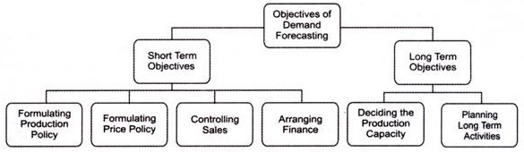
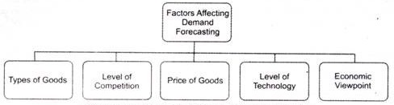
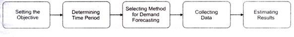

## Marketing Research ##

- [Definition](#definition)
- [Marketing Research V/S Market Research](#marketing-research-vs-market-research)
- [Marketing Research](#marketing-research-1)
- [Objectives of Marketing Research](#objectives-of-marketing-research)
- [Research Process](#research-process)
  - [Identification and Defining the Problem](#identification-and-defining-the-problem)
  - [Statement of Research Objectives](#statement-of-research-objectives)
  - [Planning the Research Design or Designing the Research Study](#planning-the-research-design-or-designing-the-research-study)
  - [Planning the Sample](#planning-the-sample)
  - [Data Collection](#data-collection)
  - [Data Processing and Analysis](#data-processing-and-analysis)
  - [Formulating Conclusion, Preparing and Presenting the Report](#formulating-conclusion-preparing-and-presenting-the-report)
- [Demand Forecasting](#demand-forecasting)
  - [Significance of Demand Forecasting](#significance-of-demand-forecasting)
  - [Objectives of Demand Forecasting](#objectives-of-demand-forecasting)
    - [Short-term Objectives](#short-term-objectives)
    - [Long-term Objectives](#long-term-objectives)
  - [Factors Influencing Demand Forecasting](#factors-influencing-demand-forecasting)
  - [Types of Forcast](#types-of-forcast)
  - [Steps of Demand Forecasting](#steps-of-demand-forecasting)

# Definition

It is very important to understand at the outset that the, modern concept of marketing revolves around the customer. Satisfaction of customer is the main aim of marketing. For achieving this goal, marketing research is undertaken.

In fact, marketing management is nothing but marketing research. With the expansion of business, marketing management becomes complex. It has to rely heavily on marketing research for solving problems in the field of marketing.

Various definitions of marketing research are given below.

> “The systematic gathering, recording and analysis of data about problems relating to the marketing of goods and services” 
> 
> —The American Marketing Association.

> “The systematic objective and exhaustive research for and study of the facts relevant to any problem in the field of marketing.”
> 
> —Richard Crisp

> “Marketing research is the careful and objective study of product design, markets, and such transfer activities as physical distribution and warehousing, advertising and sales management.”
> 
>  —Clark and Clark

> “Marketing research is the inclusive term which embraces all research activities carried on for the management of marketing work, the gathering, recording and analysing of all facts about problems relating to the transfer and sale of goods and services from producer to consumer.”
> 
> —Harry Hapner

From the above definitions, it is clear that marketing research is concerned with tackling the problems emerging from the beginning to the final stage of marketing process.

The origin and development of marketing research was started in England. In 1911, Prof. Arthur Bowie used the method of random sampling and published a paper entitled “Working Class Households.” Afterwards, it was developed by a German Prof. Whilhelm Vershofen, who is known as the father of market research.

Marketing research techniques and methods are being increasingly adopted by all the countries of the world whether developed, developing or underdeveloped. In America, marketing research is conducted by many companies on a very high scale.

# Marketing Research V/S Market Research

Marketing research is a broader term including market research. Marketing research is concerned with all the major functions of marketing. Market research is primarily concerned with knowing the capacity of the market to absorb a particular product. Marketing research is not only concerned with the jurisdiction of the market but also covers nature of the market, product analysis, sales analysis, time, place and media of advertising, personal selling and marketing intermediaries and their relationships etc.

# Marketing Research

Marketing research serves the purpose of ‘intelligence wing of the marketing management. Its scope is very broad as compared to market- research. It is concerned with collection of market information systematically and impartially, analysis and evaluation of relevant data and use such data for the benefit of the organisation.

It is a careful and objective study of various areas of marketing activities. What, when, where and how to sell the end product and the services are four questions to which the marketing research wing provides an answer.

Thus, market research and marketing research are different from each other. Market research is a narrow concept whereas marketing research is a broad one and its scope is much wider.

It includes nature of the market, product analysis, sales analysis, time, place and media of advertising, personal selling, pricing, sales organisation, packaging, brand names, etc.

# Objectives of Marketing Research

Marketing research is undertaken for attaining the following objectives.

1. To Provide Basis For Proper Planning

    Marketing and sales forecast research provides sound basis for the formulation of all marketing plans, policies, programmes and procedures.

2. To Reduce Marketing Costs
    
    Marketing research provides ways and means to reduce marketing costs like selling, advertisement and distribution etc.

3. To Find Out New Markets for The Product

    Marketing research aims at exploring new markets for the product and maintaining the existing ones.

4. To Determine Proper Price Policy

    Marketing research is considered helpful in the formulation of proper price policy with regard to the products.

5. To Study in Detail Likes and Dislikes of the Consumers

    Marketing research tries to find out what the consumers, (the men and women who constitute the market) think and want. It keeps us in touch with the consumers, minds and to study their likes and dislikes.

6. To Know The Market Competition

    Marketing research also aims at knowing the quantum of competition prevalent in the market about the product in question. The company may need reliable information about competitor’s moves and strategies which are of immense significance for further planning.

7. To Study The External Forces and Their Impact

    Marketing research provides valuable information by studying the impact of external forces on the organisation. External forces may include conditions developing in foreign markets, govt, policies and regulations, consumer incomes and spending habits, new products entering in the market and their impact on the company’s products.

Prof. Gilies has rightly pointed out that, “The basic objective of marketing research is to supply management with information which will lead to a fuller understanding of the distribution habits and attitudes of present and potential buyers and users, and their reactions to products, packing, selling and advertising methods”.

# Research Process

Some of the major steps involved in marketing research process are as follows.

1. Identification and Defining the Problem

2. Statement of Research Objectives 

3. Planning the Research Design or Designing the Research Study 

4. Planning the Sample 

5. Data Collection

6. Data Processing and Analysis

7. Formulating Conclusion, Preparing and Presenting the Report.

Marketing research exercise may take many forms but systematic enquiry is a feature common to all such forms. Being a systematic enquiry, it requires a careful planning of the orderly investigation process.

Though it is not necessary that all research processes would invariably follow a given sequence, yet marketing research often follows a generalised pattern which can be broken down and studied as sequential stages.

## Identification and Defining the Problem

The market research process begins with the identification “of a problem faced by the company. The clear-cut statement of problem may not be possible at the very outset of research process because often only the symptoms of the problems are apparent at that stage. Then, after some explanatory research, clear definition of the problem is of crucial importance in marketing research because such research is a costly process involving time, energy and money.

Clear definition of the problem helps the researcher in all subsequent research efforts including setting of proper research objectives, the determination of the techniques to be used, and the extent of information to be collected.

It may be noted that the methods of explanatory research popularly in use are—survey of secondary data, experience survey, or pilot studies, i.e., studies of a small initial sample. All this is also known as ‘preliminary investigation’.

## Statement of Research Objectives

After identifying and defining the problem with or without explanatory research, the researcher must take a formal statement of research objectives. Such objectives may be stated in qualitative or quantitative terms and expressed as research questions, statement or hypothesis. For example, the research objective, “To find out the extent to which sales promotion schemes affected the sales volume” is a research objective expressed as a statement.

On the other hand, a hypothesis is a statement that can be refuted or supported by empirical finding. The same research objective could be stated as, “To test the proposition that sales are positively affected by the sales promotion schemes undertaken this winter.”

Example of another hypothesis may be: “The new packaging pattern has resulted in increase in sales and profits.” Once the objectives or the hypotheses are developed, the researcher is ready to choose the research design.

## Planning the Research Design or Designing the Research Study

After defining the research problem and deciding the objectives, the research design must be developed. A research design is a master plan specifying the procedure for collecting and analysing the needed information. It represents a framework for the research plan of action.

The objectives of the study are included in the research design to ensure that data collected are relevant to the objectives. At this stage, the researcher should also determine the type of sources of information needed, the data collection method (e.g., survey or interview), the sampling, methodology, and the timing and possible costs of research.

## Planning the Sample

Sampling involves procedures that use a small number of items or parts of the ‘population’ (total items) to make conclusion regarding the ‘population’. Important questions in this regard are— who is to be sampled as a rightly representative lot? Which is the target ‘population’? What should be the sample size—how large or how small? How to select the various units to make up the sample?

## Data Collection

The collection of data relates to the gathering of facts to be used in solving the problem. Hence, methods of market research are essentially methods of data collection. Data can be secondary, i.e., collected from concerned reports, magazines and other periodicals, especially written articles, government publications, company publications, books, etc.

Data can be primary, i.e., collected from the original base through empirical research by means of various tools.

There can be broadly two types of sources

1. Internal sources — existing within the firm itself, such as accounting data, salesmen’s reports, etc.

2. External sources — outside the firm.

## Data Processing and Analysis

Once data have been collected, these have to be converted into a format that will suggest answers to the initially identified and defined problem. Data processing begins with the editing of data and its coding. Editing involves inspecting the data-collection forms for omission, legibility, and consistency in classification. Before tabulation, responses need to be classified into meaningful categories.

The rules for categorizing, recording and transferring the data to ‘data storage media’ are called codes. This coding process facilitates the manual or computer tabulation. If computer analysis is being used, the data can be key punched and verified.

Analysis of data represents the application of logic to the understanding of data collected about the subject. In its simplest form analysis may involve determination of consistent patterns and summarising of appropriate details.

The appropriate analytical techniques chosen would depend upon informational requirements of the problem, characteristics of the research designs and the nature of the data gathered. The statistical analysis may range from simple immediate analysis to very complex multivariate analysis.

## Formulating Conclusion, Preparing and Presenting the Report

The final stage in the marketing research process is that of interpreting the information and drawing conclusion for use in managerial decision. The research report should clearly and effectively communicate the research findings and need not include complicated statement about the technical aspect of the study and research methods.

Often the management is not interested in details of research design and statistical analysis, but instead, in the concrete findings of the research. If need be, the researcher may bring out his appropriate recommendations or suggestions in the matter. Researchers must make the presentation technically accurate, understandable and useful.

# Demand Forecasting

An organization faces several internal and external risks, such as high competition, failure of technology, labor unrest, inflation, recession, and change in government laws.

Therefore, most of the business decisions of an organization are made under the conditions of risk and uncertainty.

An organization can lessen the adverse effects of risks by determining the demand or sales prospects for its products and services in future. Demand forecasting is a systematic process that involves anticipating the demand for the product and services of an organization in future under a set of uncontrollable and competitive forces.

Some of the popular definitions of demand forecasting are as follows.

According to Evan J. Douglas,
> “Demand estimation (forecasting) may be defined as a process of finding values for demand in future time periods.”

In the words of Cundiff and Still,
> “Demand forecasting is an estimate of sales during a specified future period based on proposed marketing plan and a set of particular uncontrollable and competitive forces.”

Demand forecasting enables an organization to take various business decisions, such as planning the production process, purchasing raw materials, managing funds, and deciding the price of the product. An organization can forecast demand by making own estimates called guess estimate or taking the help of specialized consultants or market research agencies. Let us discuss the significance of demand forecasting in the next section.

## Significance of Demand Forecasting

Demand plays a crucial role in the management of every business. It helps an organization to reduce risks involved in business activities and make important business decisions. Apart from this, demand forecasting provides an insight into the organization’s capital investment and expansion decisions.

The significance of demand forecasting is shown in the following points.

1. ### Fulfilling objectives

    Implies that every business unit starts with certain pre-decided objectives. Demand forecasting helps in fulfilling these objectives. An organization estimates the current demand for its products and services in the market and move forward to achieve the set goals.

    For example, an organization has set a target of selling 50, 000 units of its products. In such a case, the organization would perform demand forecasting for its products. If the demand for the organization’s products is low, the organization would take corrective actions, so that the set objective can be achieved.

2. ### Preparing the budget

    Plays a crucial role in making budget by estimating costs and expected revenues. For instance, an organization has forecasted that the demand for its product, which is priced at Rs. 10, would be 10, 00, 00 units. In such a case, the total expected revenue would be 10* 100000 = Rs. 10, 00, 000. In this way, demand forecasting enables organizations to prepare their budget.

3. ### Stabilizing employment and production

    Helps an organization to control its production and recruitment activities. Producing according to the forecasted demand of products helps in avoiding the wastage of the resources of an organization. This further helps an organization to hire human resource according to requirement. For example, if an organization expects a rise in the demand for its products, it may opt for extra labor to fulfill the increased demand.

4. ### Expanding organizations

    Implies that demand forecasting helps in deciding about the expansion of the business of the organization. If the expected demand for products is higher, then the organization may plan to expand further. On the other hand, if the demand for products is expected to fall, the organization may cut down the investment in the business.

5. ### Taking Management Decisions

    Helps in making critical decisions, such as deciding the plant capacity, determining the requirement of raw material, and ensuring the availability of labor and capital.

6. ### Evaluating Performance

    Helps in making corrections. For example, if the demand for an organization’s products is less, it may take corrective actions and improve the level of demand by enhancing the quality of its products or spending more on advertisements.

7. ### Helping Government

    Enables the government to coordinate import and export activities and plan international trade.

## Objectives of Demand Forecasting

Demand forecasting constitutes an important part in making crucial business decisions.

The objectives of demand forecasting are divided into short and long-term objectives

### Short-term Objectives

1. #### Formulating production policy

    Helps in covering the gap between the demand and supply of the product. The demand forecasting helps in estimating the requirement of raw material in future, so that the regular supply of raw material can be maintained. It further helps in maximum utilization of resources as operations are planned according to forecasts. Similarly, human resource requirements are easily met with the help of demand forecasting.

2. #### Formulating price policy

    Refers to one of the most important objectives of demand forecasting. An organization sets prices of its products according to their demand. For example, if an economy enters into depression or recession phase, the demand for products falls. In such a case, the organization sets low prices of its products.

3. #### Controlling sales

    Helps in setting sales targets, which act as a basis for evaluating sales performance. An organization make demand forecasts for different regions and fix sales targets for each region accordingly

4. #### Arranging finance

    Implies that the financial requirements of the enterprise are estimated with the help of demand forecasting. This helps in ensuring proper liquidity within the organization.

### Long-term Objectives

1. Deciding the production capacity

    Implies that with the help of demand forecasting, an organization can determine the size of the plant required for production. The size of the plant should conform to the sales requirement of the organization.

2. Planning long-term activities

    Implies that demand forecasting helps in planning for long term. For example, if the forecasted demand for the organization’s products is high, then it may plan to invest in various expansion and development projects in the long term.

## Factors Influencing Demand Forecasting

Demand forecasting is a proactive process that helps in determining what products are needed where, when, and in what quantities. There are a number of factors that affect demand forecasting.

1. ### Types of Goods

    Affect the demand forecasting process to a larger extent. Goods can be producer’s goods, consumer goods, or services. Apart from this, goods can be established and new goods. Established goods are those goods which already exist in the market, whereas new goods are those which are yet to be introduced in the market.

    Information regarding the demand, substitutes and level of competition of goods is known only in case of established goods. On the other hand, it is difficult to forecast demand for the new goods. Therefore, forecasting is different for different types of goods.

2. ### Competition Level

    Influence the process of demand forecasting. In a highly competitive market, demand for products also depend on the number of competitors existing in the market. Moreover, in a highly competitive market, there is always a risk of new entrants. In such a case, demand forecasting becomes difficult and challenging.

3. ### Price of Goods

    Acts as a major factor that influences the demand forecasting process. The demand forecasts of organizations are highly affected by change in their pricing policies. In such a scenario, it is difficult to estimate the exact demand of products.

4. ### Level of Technology

    Constitutes an important factor in obtaining reliable demand forecasts. If there is a rapid change in technology, the existing technology or products may become obsolete. For example, there is a high decline in the demand of floppy disks with the introduction of compact disks (CDs) and pen drives for saving data in computer. In such a case, it is difficult to forecast demand for existing products in future.

5. ### Economic Viewpoint

    Play a crucial role in obtaining demand forecasts. For example, if there is a positive development in an economy, such as globalization and high level of investment, the demand forecasts of organizations would also be positive.

## Types of Forcast

Forecasts can be of three types, which are explained as follows

1. ### Short Period Forecasts

    Refer to the forecasts that are generally for one year and based upon the judgment of the experienced staff. Short period forecasts are important for deciding the production policy, price policy, credit policy, and distribution policy of the organization.

2. ### Long Period Forecasts

    Refer to the forecasts that are for a period of 5-10 years and based on scientific analysis and statistical methods. The forecasts help in deciding about the introduction of a new product, expansion of the business, or requirement of extra funds.

3. ### Very Long Period Forecasts

    Refer to the forecasts that are for a period of more than 10 years. These forecasts are carried to determine the growth of population, development of the economy, political situation in a country, and changes in international trade in future.

    Among the aforementioned forecasts, short period forecast deals with deviation in long period forecast. Therefore, short period forecasts are more accurate than long period forecasts.

4. ### Level of Forecasts

    Influences demand forecasting to a larger extent. A demand forecast can be carried at three levels, namely, macro level, industry level, and firm level. At macro level, forecasts are undertaken for general economic conditions, such as industrial production and allocation of national income. At the industry level, forecasts are prepared by trade associations and based on the statistical data.

    Moreover, at the industry level, forecasts deal with products whose sales are dependent on the specific policy of a particular industry. On the other hand, at the firm level, forecasts are done to estimate the demand of those products whose sales depends on the specific policy of a particular firm. A firm considers various factors, such as changes in income, consumer’s tastes and preferences, technology, and competitive strategies, while forecasting demand for its products.

5. ### Nature of Forecasts

    Constitutes an important factor that affects demand forecasting. A forecast can be specific or general. A general forecast provides a global picture of business environment, while a specific forecast provides an insight into the business environment in which an organization operates. Generally, organizations opt for both the forecasts together because over-generalization restricts accurate estimation of demand and too specific information provides an inadequate basis for planning and execution.

## Steps of Demand Forecasting

The Demand forecasting process of an organization can be effective only when it is conducted systematically and scientifically.

1. ### Setting the Objective

    Refers to first and foremost step of the demand forecasting process. An organization needs to clearly state the purpose of demand forecasting before initiating it.

    Setting objective of demand forecasting involves the following.

   - Deciding the time period of forecasting whether an organization should opt for short-term forecasting or long-term forecasting

   - Deciding whether to forecast the overall demand for a product in the market or only- for the organizations own products

   - Deciding whether to forecast the demand for the whole market or for the segment of the market

   - Deciding whether to forecast the market share of the organization

2. ### Determining Time Period

    Involves deciding the time perspective for demand forecasting. Demand can be forecasted for a long period or short period. In the short run, determinants of demand may not change significantly or may remain constant, whereas in the long run, there is a significant change in the determinants of demand. Therefore, an organization determines the time period on the basis of its set objectives.

3. ### Selecting a Method for Demand Forecasting

    Constitutes one of the most important steps of the demand forecasting process Demand can be forecasted by using various methods. The method of demand forecasting differs from organization to organization depending on the purpose of forecasting, time frame, and data requirement and its availability. Selecting the suitable method is necessary for saving time and cost and ensuring the reliability of the data.

4. ### Collecting Data

    Requires gathering primary or secondary data. Primary’ data refers to the data that is collected by researchers through observation, interviews, and questionnaires for a particular research. On the other hand, secondary data refers to the data that is collected in the past; but can be utilized in the present scenario/research work.

5. ### Estimating Results

    Involves making an estimate of the forecasted demand for predetermined years. The results should be easily interpreted and presented in a usable form. The results should be easy to understand by the readers or management of the organization.