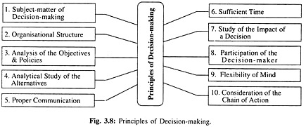

## Decision Making ##

- [Definition of Decision-Making](#definition-of-decision-making)
- [Importance of Decision-Making](#importance-of-decision-making)
- [Principles of Decision Making](#principles-of-decision-making)
- [Types of Decision](#types-of-decision)
  - [Programmed and non-programmed decisions](#programmed-and-non-programmed-decisions)
  - [Routine and strategic decisions](#routine-and-strategic-decisions)
  - [Tactical (Policy) and operational decisions](#tactical-policy-and-operational-decisions)
  - [Organisational and personal decisions](#organisational-and-personal-decisions)
  - [Major and minor decisions](#major-and-minor-decisions)
  - [Individual and group decisions](#individual-and-group-decisions)
- [Characteristics or Elements of Decision](#characteristics-or-elements-of-decision)
- [Nature of Decisions](#nature-of-decisions)

# Definition of Decision-Making

Most writers on management think that management is basically a decision-making process.

They argue that it is only through making decisions that an organisation can accom­plish its short-term and long-term goals.

A decision is an act of selection or choice of one action from several alternatives.

Decision-making can be defined as the process of selecting a right and effective course of action from two or more alternatives for the purpose of achieving a desired result. Decision-making is the essence of management.

> According to P. F. Drucker –
> 
> “What­ever a manager does he does through making decisions.”

All matters relating to planning, organising, direction, co-ordination and control are settled by the managers through decisions which are executed into practice by the operators of the enterprise. Objectives, goals, strate­gies, policies and organisational designs are all to be decided upon in order to regulate the performance of the business.

The entire managerial process is based on decisions. Decisions are needed both for tackling the problems as well as for taking maximum advantages of the opportunities available. Correct decisions reduce complexities, uncertainties and diversities of the organisational environments.

> George Terry defines decision-making 
> “as the selection of one behaviour alternative from two or more possible alternatives.”

> In the words of D. E. Mcfarland:
> 
> “A decision is an act of choice wherein an executive forms a conclusion about what must be done in a given situation. A decision represents behaviour chosen from a number of alternatives.”

>“Decision is a choice whereby a person comes to a conclusion about a situation. It represents a course of behaviour or action about what must or must not be done.”

> In other words,
> 
> “The decision is the point at which plans, policies and objectives are translated into concrete actions.“

The definition of decision-making has three different but inter-related implications.

These are as follows:

1. When the managers make decisions, they exercise choice. They decide what to do on the basis of some conscious and deliberate logic or judgement.

2. When making a decision the managers are faced with alternatives. An organisation does not take a wise manager to reach a decision when there are no other possible choices. It does require wisdom and experience to evaluate several alternatives and select the best one.

3. When taking a decision, the managers have a purpose. They propose and analyse the alternative courses of action and finally make a choice that is likely to move the organisation in the direction of its goals.

# Importance of Decision-Making

Management is essentially a bundle of decision-making process. The managers of an enterprise are responsible for making decisions and ascertaining that the decisions made are carried out in accordance with defined objectives or goals.

Decision-making plays a vital role in management. Decision-making is perhaps the most important component of a manager’s activities. It plays the most important role in the planning process. When the managers plan, they decide on many matters as what goals their organisation will pursue, what resources they will use, and who will perform each required task.

When plans go wrong or out of track, the managers have to decide what to do to correct the deviation.

In fact, the whole planning process involves the managers constantly in a series of decision-making situations. The quality of managerial decisions largely affects the effectiveness of the plans made by them. In organising process, the manager is to decide upon the structure, division of work, nature of responsibility and relationships, the procedure of establishing such responsibility and relationship and so on.

In co-ordination, decision-making is essential for providing unity of action. In control, it will have to decide how the standard is to be laid down, how the deviations from the standard are to be rectified, how the principles are to be established how instructions are to be issued, and so on.

The ability to make good decisions is the key to successful managerial performance. The managers of most profit-seeking firms are always required to take a wide range of important decision in the areas of pricing, product choice, cost control, advertising, capital investments, dividend policy, personnel matters, etc. Similarly, the managers of non-profit seeking concerns and public enterprises also face the challenge of taking vital decisions on many important matters.

Decision-making is also a criterion to determine whether a person is in management or not. If he participates in decision-making, he is regarded as belonging to management staff. In the words of George Terry: “If there is one universal mark of a manager, it is decision-making.”

> According to P. F. Drucker:
> 
> “Whatever a manager does, he does through making decisions.”

In any business, whether large or small, the conditions are never static, they are perceptively dynamic. The old order is always yielding place to new either in personnel or in unforeseen contingencies. Changes in conditions are the usual rule. Such a situation calls for actions that involve decision-making.

So, decision-making is deeply related with management functions and both are bound up together inseparably. When a manager plans or organises, orders or advises, approves or disapproves anything, he will have to move with the process of decision-making. In all managerial functions, decision-making is an indispensable accompaniment.

# Principles of Decision Making

Effective decision involves two important aspects—the purpose for which it is intended, and the environmental situation in which it is taken. Even the best and correct decision may become ineffective if these aspects are ignored; because in decision-making there are so many inside and outside chains of unavoidable reactions.

If certain principles are followed for decision-making, such multidimensional reactions can mostly be overcome.

These principles are stated as follows:

1. ## Subject-matter of Decision-making
    
    Decisional matters or problems may be divided into groups consisting of programmed and non-programmed problems. Programmed problems, being of routine nature, repetitive and well-founded, are easily definable and, as such, require simple and easy solution. Decision arrived in such programmed problems has, thus, a continuing effect. But in non-programmed problems, there is no continuing effect because they are non-repetitive, non-routine, and novel. Every event in such problems requires individual attention and analysis and its decision is to be arrived at according to its special features and circumstances.

2. ## Organisational Structure
    
    The organisational structure, having an important bearing on decision-making, should be readily understood. If the organisational structure is rigid and highly centralised, decision-making authority will remain confined to the top management level. This may result in delayed and confused decision and create suspicion among the employees.

    On the contrary, if the organisational structure provides   scope for adequate delegation and decentralisation of authority, decision-making will be flexible and the decision-making authority will be close to the operating centres. In such a situation, decision-making will be prompt and expected to be more effective and acceptable.

3. ## Analysis of the Objectives and Policies

    Proper analysis of the objectives and policies is needed for decision-making. The clear definition of objectives and policies is the basis that guides the direction of decision-making. Without this basis, decision-making will be aimless and unproductive.

4. ## Analytical Study of the Alternatives
    
    For decision-making, analytical study of all possible alternatives of a problem with their merits and demerits is essential. This is necessary to make out a correct selection of decision from among the alternatives.

5. ## Proper Communication System

    Effective decision-making demands a machinery for proper communication of information to all responsibility centres in the organisation. Unless this structure is built up, ignorance of decision or ill-informed decision will result in misunderstanding and loose co-ordination.

6. ## Sufficient Time

    Effective decision-making requires sufficient time. It is a matter of common experience that it is usually helpful to think over various ideas and possibilities of a problem for the purpose of identifying and evaluating it properly. But in no case a decision can be delayed for an indefinite period, rather it should be completed well in advance of the scheduled dates.

7. ## Study of the Impact of a Decision

    Decision is intended to be carried out for the realisation of the objectives of the organisation. A decision in any particular area may react adversely in other areas of the organisation. As all business activities are inter-related and require co-ordination, it is necessary that a study and analysis of the impact of any decision should precede its application.

8. ## Participation of the Decision-maker

    The decision-maker should not only be an observer while others will perform as per his decision. He should also participate in completing the work for which decision was taken by him. This experience will help him in decision-making in future. The principle of participation in work of the decision-maker will enable him to understand whether the decision taken is practical and also guide him in forthcoming decisional matters.

9. ## Flexibility of Mind

    This is essential in decision-making, because decisions cannot satisfy everybody. Rigid mental set-up of the decision-maker may upset the decisions. The flexible mental disposition of the decision-maker enables him to change the decision and win over the co-operation of all the diverse groups.

10. ## Consideration of the Chain of Actions

    There is a chain relationship in all the activities of any organisation. Different activities are tied up in a chain sequence. Any decision to change a particular work brings change in other related works also. Similarly, decision-making also proceeds following the chain of action in different activities. Therefore, before taking a decision one should consider the chain relationship among different activities.

# Types of Decision

Following are important types of decisions:

## Programmed and non-programmed decisions

Programmed decisions are concerned with the problems of repetitive nature or routine type matters.

A standard procedure is followed for tackling such problems. These decisions are taken generally by lower level managers. Decisions of this type may pertain to e.g. purchase of raw material, granting leave to an employee and supply of goods and implements to the employees, etc. Non-programmed decisions relate to difficult situations for which there is no easy solution.

These matters are very important for the organisation. For example, opening of a new branch of the organisation or a large number of employees absenting from the organisation or introducing new product in the market, etc., are the decisions which are normally taken at the higher level.

## Routine and strategic decisions

Routine decisions are related to the general functioning of the organisation. They do not require much evaluation and analysis and can be taken quickly. Ample powers are delegated to lower ranks to take these decisions within the broad policy structure of the organisation.

Strategic decisions are important which affect objectives, organisational goals and other important policy matters. These decisions usually involve huge investments or funds. These are non-repetitive in nature and are taken after careful analysis and evaluation of many alternatives. These decisions are taken at the higher level of management.

## Tactical (Policy) and operational decisions

Decisions pertaining to various policy matters of the organisation are policy decisions. These are taken by the top management and have long term impact on the functioning of the concern. For example, decisions regarding location of plant, volume of production and channels of distribution (Tactical) policies, etc. are policy decisions. Operating decisions relate to day-to-day functioning or operations of business. Middle and lower level managers take these decisions.

An example may be taken to distinguish these decisions. Decisions concerning payment of bonus to employees are a policy decision. On the other hand if bonus is to be given to the employees, calculation of bonus in respect of each employee is an operating decision.

## Organisational and personal decisions

When an individual takes decision as an executive in the official capacity, it is known as organisational decision. If decision is taken by the executive in the personal capacity (thereby affecting his personal life), it is known as personal decision.

Sometimes these decisions may affect functioning of the organisation also. For example, if an executive leaves the organisation, it may affect the organisation. The authority of taking organizational decisions may be delegated, whereas personal decisions cannot be delegated.

## Major and minor decisions

Another classification of decisions is major and minor. Decision pertaining to purchase of new factory premises is a major decision. Major decisions are taken by top management. Purchase of office stationery is a minor decision which can be taken by office superintendent.

## Individual and group decisions

When the decision is taken by a single individual, it is known as individual decision. Usually routine type decisions are taken by individuals within the broad policy framework of the organisation.

Group decisions are taken by group of individuals constituted in the form of a standing committee. Generally very important and pertinent matters for the organisation are referred to this committee. The main aim in taking group decisions is the involvement of maximum number of individuals in the process of decision­- making.

# Characteristics or Elements of Decision

The important characteristics or features of a decision are as follows:

1. **It is Normally Rational and Based on Reason —** A manager/Administrator must have calculation, reasoning and deliberation before he arrives at any final solution or choice to any problem.

2. **It is Selective and Involves Selection of the Best —** A manager must apply intelligence while selecting the best course from among the available alternative courses.

3. **It is Usually Positive and Relates Means to the End —** The manager must know that the solution to any problem provides an effective means, the desired end or goal.

4. **It is Normally Positive, but We May have even a Negative Decision —** It means a decision not to act. For example—A car manufacturing company decided not to change the model and size of the car though the other rival company was planning to introduce a new model every year. Sometimes a negative decision is also important.

# Nature of Decisions

According to P. Drucker there are normally four basic criteria which determine the nature of a decision and the level of authority. They are :

1. **Time Involved in Future —** How much time a manager will take in taking decision over a particular problem ?

2. **The Quantitative Factor’s Entering into a Decision —** Among the various factors available at the time of taking decision the manager must study carefully the qualitative factors.

3. **Rare or Routine and Repetitive Decision —** At the time of taking decision the manager must ascertain whether the decision which he is taking is rare or routine or repetitive. And he must act accordingly.

4. **Impact of the Decision —** The manager must keep and think in mind that-whether the impact of the decision is on other functions areas or on the business as a whole. If it is going to affect only one function then it is of the lowest order.

Types of Decisions