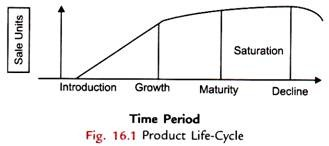

# Project Appraisal #

Project appraisal is the structured process of assessing the viability of a project or proposal. It involves calculating the feasibility of the project before committing resources to it. It is a tool that company’s use for choosing the best project that would help them to attain their goal. Project appraisal often involves making comparison between various options and this done by making use of any decision technique or economic appraisal technique.

Project appraisal is a tool which is also used by companies to review the projects completed by it. This is done to know the effect of each project on the company. This means that the project appraisal is done to know, how much the company has invested on the project and in return how much it is gaining from it.

# Process of project appraisal

The process of project appraisal consists of five steps and they are – initial assessment, defining problem and long-list, consulting and short-list, developing options, and comparing and selecting project. The process of appraisal generally starts from the initial phase of the project. If the appraisal process starts from an early stage, then the company will be in a better position to decide how capital should be spend in the project and also it will help them to make the decision of not spending too much or stopping a project that is not economically viable.

# Methods of project appraisal

## Economic Analysis

Under economic analysis, the project aspects highlighted include requirements for raw material, level of capacity utilization, anticipated sales, anticipated expenses and the probable profits. It is said that a business should have always a volume of profit clearly in view which will govern other economic variables like sales, purchases, expenses and alike.

It will have to be calculated how much sales would be necessary to earn the targeted profit. Undoubtedly, demand for the product will be estimated for anticipating sales volume. Therefore, demand for the product needs to be carefully spelled out as it is, to a great extent, deciding factor of feasibility of the project concern.

In addition to above, the location of the enterprise decided after considering a gamut of points also needs to be mentioned in the project. The Government policies in this regard should be taken into consideration. The Government offers specific incentives and concessions for setting up industries in notified backward areas. Therefore, it has to be ascertained whether the proposed enterprise comes under this category or not and whether the Government has already decided any specific location for this kind of enterprise.

## Financial Analysis

Finance is one of the most important pre-requisites to establish an enterprise. It is finance only that facilitates an entrepreneur to bring together the labour of one, machine of another and raw material of yet another to combine them to produce goods.

In order to adjudge the financial viability of the project, the following aspects need to be carefully analysed:

1. Assessment of the financial requirements both – fixed capital and working capital need to be properly made. You might be knowing that fixed capital normally called ‘fixed assets’ are those tangible and material facilities which purchased once are used again and again. Land and buildings, plants and machinery, and equipment’s are the familiar examples of fixed assets/fixed capital. The requirement for fixed assets/capital will vary from enterprise to enterprise depending upon the type of operation, scale of operation and time when the investment is made. But, while assessing the fixed capital requirements, all items relating to the asset like the cost of the asset, architect and engineer’s fees, electrification and installation charges (which normally come to 10 per cent of the value of machinery), depreciation, pre-operation expenses of trial runs, etc., should be duly taken into consideration. Similarly, if any expense is to be incurred in remodeling, repair and additions of buildings should also be highlighted in the project report.

2. In accounting, working capital means excess of current assets over current liabilities. Generally, 2: 1 is considered as the optimum current ratio. Current assets refer to those assets which can be converted into cash within a period of one week. Current liabilities refer to those obligations which can be payable within a period of one week. In short, working capital is that amount of funds which is needed in day today’s business operations. In other words, it is like circulating money changing from cash to inventories and from inventories to receivables and again converted into cash.

This circle goes on and on. Thus, working capital serves as a lubricant for any enterprise, be it large or small. Therefore, the requirements of working capital should be clearly provided for. Inadequacy of working capital may not only adversely affect the operation of the enterprise but also bring the enterprise to a grinding halt.

The activity level of an enterprise expressed as capacity utilization, needs to be well spelt out in the business plan or project report. However, the enterprise sometimes fails to achieve the targeted level of capacity due to various business vicissitudes like unforeseen shortage of raw material, unexpected disruption in power supply, inability to penetrate the market mechanism, etc.

Then, a question arises to what extent and enterprise should continue its production to meet all its obligations/liabilities. ‘Break-even analysis’ (BEP) gives an answer to it. In brief, break-even analysis indicates the level of production at which there is neither profit nor loss in the enterprise. This level of production is, accordingly, called ‘break-even level’.

## Market Analysis

Before the production actually starts, the entrepreneur needs to anticipate the possible market for the product. He/she has to anticipate who will be the possible customers for his product and where and when his product will be sold. There is a trite saying in this regard: “The manufacturer of an iron nails must know who will buy his iron nails.”

This is because production has no value for the producer unless it is sold. It is said that if the proof of pudding lies in eating, the proof of all production lies in marketing/ consumptio. In fact, the potential of the market constitutes the determinant of probable rewards from entrepreneurial career.

Thus, knowing the anticipated market for the product to be produced becomes an important element in every business plan. The various methods used to anticipate the potential market, what is named in ‘Managerial Economics’ as ‘demand forecasting’, range from the naive to sophisticated ones.

The commonly used methods to estimate the demand for a product are as follows:

### Opinion Polling Method

In this method, the opinions of the ultimate users, i.e. customers of the product are estimated. This may be attempted with the help of either a complete survey of all customers (called, complete enumeration) or by selecting a few consuming units out of the relevant population (called, sample survey).

Let us discuss these in some details:

1. #### Complete Enumeration Survey

    In this survey, all the probable customers of the product are approached and their probable demands for the product are estimated and then summed. Estimating sales under this method is very simple. It is obtained by simply adding the probable demands of all customers. An example should make it clear.

    Suppose, there are total N customers of X product and everybody will demand for D numbers of it. Then, the total anticipated demand will be:

    > N ∑ i = 1 Di N

    Though the principle merit of this method is that it obtains the first-hand and unbiased information, yet it is beset with some disadvantages also. For example, to approach a large number of customers scattered all over market becomes tedious, costly and cumbersome. Added to this, the consumers themselves may not divulge their purchase plans due to the reasons like their personal as well commercial/business privacies.

2. #### Sample Survey

    Under this method, only some number of consumers out of their total population is approached and data on their probable demands for the product during the forecast period are collected and summed. The total demand of sample customers is finally blown up to generate the total demand for the product. Let this also be explained with an example.

    Imagine, there are 1000 customers of a product spread over the Faridabad market. Out of these, 50 are selected for survey using stratified method. Now, if the estimated demand of these sample customers is Di, i.e., it refers to 1 2 3….50, the total demand for the entire group of customers will be

    > 50 ∑ ni Di = n1 D1 +n2D2 + n3 D3…….. n50 D50
    >
    > Where n, is the number of customers in group i, and n1 +n2 + n3….n50 = 1000.

    But, if all the 1000 customers of the group are alike, then the selection may be done on a random basis and total demand for the group will be:

    > (D1 D2 + D3 +D4…D5) 1000 /50

    No doubt, survey method is less costly and tedious than the complete enumeration method.

3. #### Sales Experience Method

    Under this method, a sample market is surveyed before the new product is offered for sale. The results of the market surveyed are then projected to the universe in order to anticipate the total demand for the product.

    In principle, the survey market should be the true representative of the national market which is not always true. Suppose, if Delhi is selected as a sample market, it may not be a true representative of a small place, say Silchar in Assam simply because the characteristic features of Delhi are altogether different from those of a small town like Silchar.

    Again, if we select Agra as a sample market, sales in Agra would be influenced by the size of the floating tourist’s population throughout the year. But this feature is not experienced by many other places again like Silchar in Assam.

4. #### Vicarious Method

    Under the vicarious method, the consumers of the product are not approached directly but indirectly through some dealers who have a feel of their customers. The dealers’ opinions about the customers’ opinion are elicited. Being based on dealers’ opinions, the method is bound to suffer from the bias on the part of the dealers. Then, the results derived are likely to be unrealistic. However, these hang-ups are not avoidable also.

### Life Cycle Segmentation Analysis

It is well established that like a man, every product has its own life span. In practice, a product sells slowly in the beginning. Backed by sales promotion strategies over period, its sales pick up. In the due course of time, the peak sale is reached. After that point, the sales begin to decline. After, some time, the product loses its demand and dies. This is natural death of a product. Thus, every product passes through its ‘life cycle’. This is precisely the reason why firms go for new products one after another to keep themselves alive.

Based on above, the product life cycle has been divided into the following five stages.

1. Introduction

2. Growth

3. Maturity

4. Saturation

5. Decline

The sales of the product vary from stage to stage and follows S-shaped curve as shown below.

Considering the above five stages of a product life cycle, the sales at different stages can be anticipated.

## Technical Feasibility

While making project appraisal, the technical feasibility of the project also needs to be taken into consideration. In the simplest sense, technical feasibility implies to mean the adequacy of the proposed plant and equipment to produce the product within the prescribed norms. As regards know-how, it denotes the availability or otherwise of a fund of knowledge to run the proposed plants and machinery.

It should be ensured whether that know-how is available with the entrepreneur or is to be procured from elsewhere. In the latter case, arrangement made to procure it should be clearly checked up. If project requires any collaboration, then, the terms and conditions of the collaboration should also be spelt out comprehensively and carefully.

In case of foreign technical collaboration, one needs to be aware of the legal provisions in force from time to time specifying the list of products for which only such collaboration is allowed under specific terms and conditions. The entrepreneur, therefore, contemplating for foreign collaboration should check these legal provisions with reference to their projects.

While assessing the technical feasibility of the project, the following inputs covered in the project should also be taken into consideration.

1. Availability of land and site.

2. Availability of other inputs like water, power, transport, communication facilities.

3. Availability of servicing facilities like machine shops, electric repair shop, etc.

4. Coping-with anti-pollution law.

5. Availability of work force as per required skill and arrangements proposed for training-in-plant and outside.

6. Availability of required raw material as per quantity and quality.

## Management Competence

Management ability or competence plays an important role in making an enterprise a success or otherwise. Strictly speaking, in the absence of managerial competence, the projects which are otherwise feasible may fail.

On the contrary, even a poor project may become a successful one with good managerial ability. Hence, while doing project appraisal, the managerial competence or talent of the promoter should be taken into consideration.

Research studies report that most of the enterprises fall sick because of lack of managerial competence or mismanagement. This is more so in case of small-scale enterprises where the proprietor is all in all, i.e., owner as well as manager. Due to his one-man show, he may be jack of all but master of none.