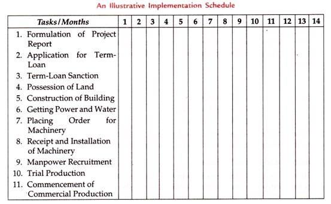

## Project Formulation ##

We know that a project grows out of problems or opportunities. Therefore, the need for a project is felt by the project owner (an individual or an organisation), proposing to undertake a project. In the complexities of the business world, it is almost impossible for an organisation to start investing in a business before a plan is drawn for such business—a plan for the proposed investment.

The project formulation is a systemic expression of such plan with detailed estimates within certain parameters. Such estimates in order to be more realistic and reliable are based on actual experiences, environments along with the trends forecasted for the coming years. All these are formulated in a ‘project report’. The project formulation needs lot of functional support from the specialists in their relevant fields.

Once the project has been identified necessary steps are taken to explore and assess the viability of the project.

It involves a study in one or more or all of the following areas.

## Technical

- Whether the technology involved in the project is appropriate to meet the objectives, to ensure that

- It is not an obsolete technology;

- The technical collaborator is capable to impart such technology often assured by a term of buy-back of part of the production;

- The other terms for the know-how are reasonable and acceptable as per norms.

## Economical

- The investment for the project is justified considering the overall economical situation and, in particular, relevant to the industry for which the project is being planned.

- The project cost is justified as against the economic benefit to be derived from it.

## Financial

- The necessary resources will be available in time during the implementation of the project and its subsequent operation. Experience indicates that many projects, after being partially carried out, are stopped (particularly in the public sector) due to lack of funds leading to delay in its implementation and cost escalation.

- The estimated revenue to be generated from the project after being implemented is sufficient to justify the project capital cost.

## Social

The objective of the project is to serve common people through rural development, education, health-care etc. It should be ensured that sufficient funds are available to maintain such project e.g. a hospital built-up and equipped with necessary machineries/apparatus could not be run in the absence of funds to pay the doctors, nurses/maintenance staff etc.

Such studies are made and database prepared having information from various authentic sources as well as professional bodies, market research & analysts etc. The preparation of a project report passes through phases as project profile, pre-feasibility, feasibility and end up with a detailed project report (DPR).

Every such study is a costly affair, and it is not a must that a project should pass through all such studies. The status of the studies and reliability of the forecasted details in the report (pre-feasibility, feasibility etc.) improve with the managerial decision to dig in further as well as more detailed information available with the passage of time.

Thus, the project formulation develops from a Project Profile to a DPR. On the other hand, the project owner may even look for a DPR without any other reports as project profile etc.

# Stages in project formulation

Normally, micro and small-scale enterprises do not include sophisticated techniques which are used for preparing project reports of large-scale enterprises. Within the small-scale enterprises too, all the information may not be homogeneous for all units.

In fact, what and how much information will be given in the project report depends upon the size of the unit as well as nature of the production. A general set of information given in any project report is listed by Vinod Gupta (1999) in his study on `“Formulation of a Project Report”.`  We are reproducing it here for your information and knowledge.

Project formulation divides the process of project development into eight distinct and sequential stages.

1. General Information

2. Project Description

3. Market Potential

4. Capital Costs and Sources of Finance

5. Assessment of Working Capital Requirements

6. Other Financial Aspects

7. Economic and Social Variables

8. Project Implementation

## General Information

The information of general nature given in the project report includes the following:

1. ### Bio-data of Promoter

    Name and address of entrepreneur; the qualifications, experience and other capabilities of the entrepreneur; if these are partners, state these characteristics of all the partners individually.

2. ### Industry Profile

    A reference of analysis of industry to which the project belongs, e.g., past performance, present status, its organisation, its problems, etc.

3. ### Constitution and Organisation

    The constitution and organisational structure of the enterprise, in case of partnership firm, its registration with the Registrar of Firms; application for getting Registration Certificate from the Directorate of Industries/District Industry Centre, etc.

4. ### Product Details

    Product utility, product range; product design; advantages to be offered by the product over its substitutes, if any.

## Project Description

A brief description of the project covering the following aspects is given in the project report.

1. ### Site

    Location of enterprise; owned or leasehold land; industrial area; No Objection Certificate (NOC) from the Municipal Authorities if the enterprise location falls in the residential area.

2. ### Physical Infrastructure

    Availability of the following items of infrastructure should be mentioned in the project report:

      - Raw Material

        Requirement of raw material, whether inland or imported, sources of raw material supply.

      - Skilled Labour:

        Availability of skilled labour in the area, arrangements for training labourers in various skills.

3. ### Utilities
    These include:

      - **Power:** Requirement for power, load sanctioned availability of power.

      - **Fuel:** Requirement for fuel items such as coal, coke, oil or gas, state of their availability.
      
      - **Water:** The sources and quality of water required should be clearly stated in the project report.

4. ### Pollution Control

    The aspects like scope of dumps, sewage system and sewage treatment plant should be clearly stated in case of industries producing emissions.

5. ### Communication System

    Availability of communication facilities, e.g., telephone, telexes etc. should be stated in the project report.

6. ### Transport Facilities

    Requirements for transport, mode of transport, potential means of transport, distances to be covered, bottlenecks etc., should be stated in the business plan.

7. ### Other Common Facilities

    Availability of common facilities like machine shops, welding shops and electrical repair shops etc. should be stated in the report.

8. ### Production Process

    A mention should be made for process involved in production and period of conversion from raw material into finished goods.

9. ### Machinery and Equipment

    A complete list of items of machinery and equipment’s required indicating their size, type, cost and sources of their supply should be enclosed with the project report.

10. ### Capacity of the Plant

    The installed licensed capacity of the plant along with the shifts should also be mentioned in the project report.

11. ### Technology Selected

    The selection of technology, arrangements made for acquiring it should be mentioned in the business plan.

12. ### Research and Development

    A mention should be made in the project report regarding proposed research and development activities to be undertaken in future.

## Market Potential

While preparing a project report, the following aspects relating to market potential of the product should be stated in the report:

1. ### Demand and Supply Position

    State the total expected demand for the product and present supply position. This should also be mentioned how much of the gap will be filled up by the proposed unit.

2. ### Expected Price

    An expected price of the product to be realised should be mentioned in the project report.

3. ### Marketing Strategy

    Arrangements made for selling the product should be clearly stated in the project report.

4. ### After-Sales Service

    Depending upon the nature of the product, provisions made for after-sales service should normally be stated in the project report.

5. ### Transportation

    Requirement for transportation means indicating whether public transport or entrepreneur’s own transport should be mentioned in the project report.

## Capital Costs and Sources of Finance

An estimate of the various components of capital items like land and buildings, plant and machinery, installation costs, preliminary expenses, margin for working capital should be given in the project report. The present probable sources of finance should also be stated in the project report. The sources should indicate the owner’s funds together with funds raised from financial institutions and banks.

##  Assessment of Working Capital Requirements

The requirement for working capital and its sources of supply should be carefully and clearly mentioned in the business plan or project report. It is always better to prepare working capital requirements in the prescribed formats designed by limits of requirement. It will minimise objections from the banker’s side.

## Other Financial Aspects

In order to adjudge the profitability of the project to be set up, a projected Profit and Loss Account indicating likely sales revenue, cost of production, allied cost and profit should be prepared. A projected Balance Sheet and Cash Flow Statement should also be prepared to indicate the financial position and requirements at various stages of the project.

In addition to above, the Break-Even Analysis should also be presented in the project report. Break-even point is the level of production/ sales where the industrial enterprise shall earn neither profit nor incur loss. In fact, it will just break even. Break-even level indicates the gestation period and the likely moratorium required for repayment of loans.

Break-even point (BEP) is calculated as follows:

> BEP = F / S - V x 100
> 
> where, F = Fixed Cost
> 
> S = Sales Projected
> 
> V = Variable Costs

Thus, the break-even point so calculated will indicate at what percentage of sales, the enterprise will break even i.e., no profit, no loss.

## Economic and Social Variables

In view of the social responsibility of business, the abatement costs, i.e., the costs for controlling the environmental damage should be stated in the project. Arrangements made for treating the effluents and emissions should also be mentioned in the report.

Besides, the socio-economic benefits expected to accrue from the project should also be stated in the report itself.

Following are the examples of socio­economic benefits:

1. Employment Generation

2. Import Substitution

3. Ancillarisation

4. Exports

5. Local Resource Utilization

6. Development of the Area

## Project Implementation

Last but no means the least, every entrepreneur should draw an implementation scheme or a time-table for his project to ensure the timely completion of all activities involved in setting-up an enterprise. Timely implementation is important because if there is a delay, it causes, among other things, a project cost overrun.

In India, delays in project implementation have become a common feature. Delay in project implementation jeopardizes the financial viability of the project, on the one hand, and props up the entrepreneur to drop the idea to set-up an enterprise, on the other. Hence, there is a need to draw up an implementation schedule for the project and then to adhere to it to complete the project in time.

The above schedule can be broken up into scores of specific tasks involved in setting up the enterprise. “Project Evaluation and Review Technique (PERT)’ and “Critical Path Method (CPM)’ can also be used to get better insights into all activities related to implementation of the project.
